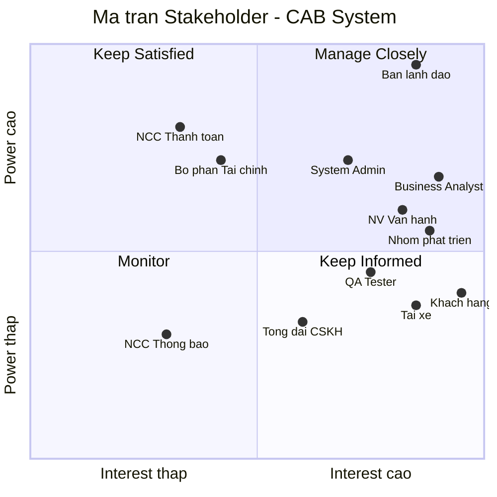
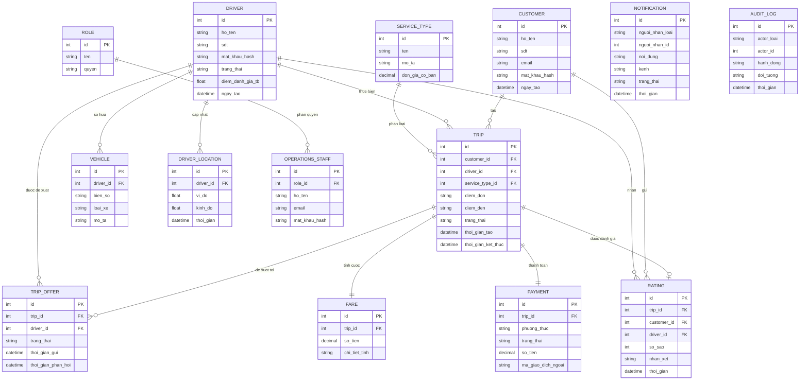
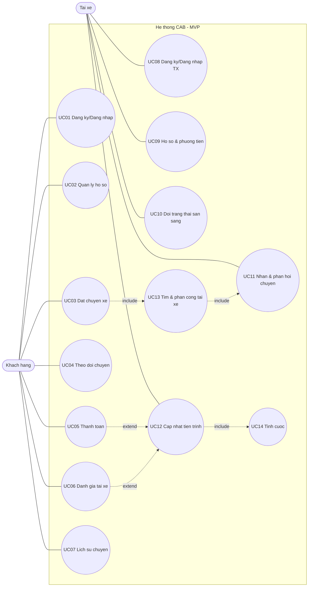

## Bước 1: Đọc và phân tích yêu cầu của khách hàng ở giai đoạn sơ khởi 
Hiểu **business context (ngữ cảnh nghiệp vụ)** và **business problem (vấn đề nghiệp vụ)**.

### 1. Ngữ cảnh nghiệp vụ (Business Context)
Công ty ABC là doanh nghiệp cung cấp dịch vụ đặt xe trực tuyến. Ở hiện trạng, khách hàng đặt xe qua hai kênh: gọi tổng đài hoặc dùng một ứng dụng đơn giản. Việc điều phối phía sau chủ yếu thủ công.
Mục tiêu của ban lãnh đạo không phải là "vá" ứng dụng cũ, mà xây một nền tảng CAB mới phục vụ được số lượng lớn khách hàng và tài xế, và quan trọng hơn là có thể mở rộng thêm tính năng trong tương lai (thêm loại dịch vụ, phương thức thanh toán, kênh thông báo…) mà không phải xây lại toàn bộ.
**Ba yếu tố định hình ngữ cảnh cần ghi nhớ:**
- **Ràng buộc thời gian:** chỉ 7 tuần để xây dựng và triển khai → phạm vi phải được cắt gọn, ưu tiên một luồng lõi chạy được (đây chính là lý do có phần "demo tối thiểu / MVP").
- **Ba nhóm người dùng chính:** Khách hàng, Tài xế, Nhân viên vận hành (admin). Đây là các tác nhân (actor) trung tâm.
- **Phụ thuộc bên ngoài:** nhà cung cấp thanh toán và (tương lai) các nhà cung cấp thông báo — hệ thống tích hợp chứ không tự xử lý mọi thứ.
### 2. Vấn đề nghiệp vụ (Business Problem)
| # | Vấn đề hiện tại | Hệ quả nghiệp vụ |
|---|---|---|
| 1 | Phân công tài xế thủ công | Chậm, dễ sai, không thể phục vụ số lượng lớn, phụ thuộc con người |
| 2 | Khách hàng khó theo dõi trạng thái chuyến | Trải nghiệm kém, khách gọi hỏi tổng đài nhiều, mất niềm tin |
| 3 | Thông tin thanh toán không quản lý tập trung | Khó đối soát, khó báo cáo doanh thu, khó kiểm toán |
| 4 | Bộ phận vận hành khó mở rộng hệ thống | Không chịu tải được lúc cao điểm, tăng trưởng bị nghẽn |
| 5 | Khó thêm tính năng mới | Kiến trúc cứng, mỗi thay đổi ảnh hưởng toàn hệ thống |
**Vấn đề gốc rễ (root cause):** hệ thống hiện tại vừa vận hành thủ công vừa thiếu tính module/khả năng mở rộng. Đây chính là lý do tài liệu nhấn mạnh yêu cầu phi chức năng: các thành phần (thanh toán, thông báo…) phải mở rộng độc lập và một lỗi ở thanh toán/thông báo không được làm sập cả hệ thống đặt xe. Nói cách khác, bài toán không chỉ là "làm app đặt xe" mà là "làm một nền tảng chịu tải, tách rời và dễ tiến hóa".

Bước 2: Xác định stackholder - những bên tham gia hệ thống (lặp bảng gồm 2 cột: tên stackholder và vai trò ), vẽ ma trận stackholder matric bằng công cụ Mermaid để vẽ sơ đồ lược đồ trong markdown
| Tên Stakeholder | Vai trò trong hệ thống |
|---|---|
| **Khách hàng (Customer)** | Người dùng cuối đặt xe: đăng ký/đăng nhập, nhập điểm đón–đến, chọn loại xe, gửi yêu cầu, theo dõi chuyến, thanh toán và đánh giá tài xế. |
| **Tài xế (Driver)** | Người nhận và thực hiện chuyến: cập nhật hồ sơ/phương tiện, chuyển trạng thái sẵn sàng, nhận/từ chối chuyến, cập nhật tiến trình và vị trí. |
| **Nhân viên vận hành (Operations Staff)** | Quản trị khách hàng, tài xế, phương tiện, chuyến đi; theo dõi chuyến đang chạy, xử lý chuyến lỗi, tra cứu giao dịch. |
| **Quản trị viên hệ thống (System Admin)** | Phân quyền, cấu hình, thực hiện thao tác nhạy cảm, quản lý lưu vết (audit) và an toàn hệ thống. |
| **Ban lãnh đạo / Ban giám đốc (Executive)** | Đặt tầm nhìn, phê duyệt phạm vi & ngân sách, theo dõi báo cáo doanh thu, tỷ lệ hoàn thành/hủy, hiệu quả tài xế. |
| **Bộ phận Tài chính – Kế toán (Finance)** | Đối soát thanh toán, quản lý doanh thu tập trung, lập báo cáo tài chính. |
| **Chăm sóc khách hàng / Tổng đài (Customer Support)** | Hỗ trợ khách qua kênh gọi/hotline, tiếp nhận và xử lý khiếu nại, hỗ trợ sự cố chuyến đi. |
| **Business Analyst (BA)** | Thu thập & làm rõ yêu cầu, xác định phạm vi/quy tắc nghiệp vụ/ngoại lệ, làm cầu nối giữa khách hàng và nhóm phát triển. |
| **Nhóm phát triển (Development Team)** | Thiết kế kiến trúc, xây dựng, tích hợp các thành phần (đặt xe, ghép tài xế, thanh toán, thông báo…). |
| **QA / Kiểm thử (Tester)** | Kiểm thử chức năng & phi chức năng, đảm bảo chất lượng, độ ổn định lúc cao điểm. |
| **Nhà cung cấp thanh toán (Payment Provider)** | Đối tác ngoài xử lý giao dịch điện tử; CAB **không lưu** thông tin thẻ/tài khoản nhạy cảm. |
| **Nhà cung cấp thông báo (Notification Provider)** | Đối tác ngoài gửi SMS/Push/Email; kiến trúc phải cho phép mở rộng thêm kênh sau này. |

Bước 3: Xác định business goal (mục đích) - ví dụ: BG01: Giảm thời gian tìm tài xế - Mục đích: tự động tìm tài xế, BG02:   Hỗ trợ thanh toán - Mục đích: cho phép thanh toán bằng tiền mặt hoặc trực tuyến
| Mã | Business Goal | Mục đích |
|---|---|---|
| **BG01** | Giảm thời gian tìm tài xế | Tự động tìm và ghép tài xế phù hợp theo vị trí, trạng thái sẵn sàng thay cho phân công thủ công. |
| **BG02** | Hỗ trợ thanh toán linh hoạt | Cho phép thanh toán bằng tiền mặt hoặc trực tuyến, tích hợp cổng thanh toán ngoài mà không lưu dữ liệu thẻ nhạy cảm. |
| **BG03** | Tăng khả năng theo dõi chuyến đi | Cho khách hàng theo dõi trạng thái chuyến theo thời gian thực: đang tìm tài xế, tài xế đã nhận, thời gian đến dự kiến, tiến trình chuyến. |
| **BG04** | Xử lý ghép tài xế thông minh | Ưu tiên tài xế gần và phù hợp, tự chuyển sang tài xế khác khi bị từ chối/không phản hồi mà không bắt khách tạo lại yêu cầu. |
| **BG05** | Quản lý thanh toán & doanh thu tập trung | Tập trung dữ liệu giao dịch để đối soát, xác định cước theo loại dịch vụ và báo cáo doanh thu chính xác. |
| **BG06** | Thông báo đa kênh, dễ mở rộng | Gửi thông báo cho khách và tài xế ở các mốc quan trọng; kiến trúc cho phép thêm kênh thông báo mới mà không đổi toàn hệ thống. |
| **BG07** | Cung cấp công cụ vận hành & quản trị | Trang bị giao diện quản trị để quản lý khách hàng, tài xế, phương tiện, chuyến đi và xử lý chuyến lỗi. |
| **BG08** | Hỗ trợ ra quyết định bằng báo cáo | Cung cấp báo cáo số chuyến, doanh thu, tỷ lệ hoàn thành/hủy và hiệu quả tài xế cho ban lãnh đạo. |
| **BG09** | Đảm bảo độ ổn định khi tải cao | Giữ hệ thống hoạt động ổn định lúc cao điểm; lỗi ở thanh toán/thông báo không làm sập luồng đặt xe. |
| **BG10** | Bảo mật & phân quyền | Xác thực người dùng, kiểm soát quyền truy cập cho thao tác quản trị, bảo vệ dữ liệu cá nhân/vị trí/giao dịch. |
| **BG11** | Lưu vết phục vụ kiểm tra | Ghi log các thao tác quan trọng để truy vết và điều tra khi có sự cố. |

--
Bước 4: Xác định phạm vi - (ví dụ: quản lý khách hàng, quản lý tài xế) - phải liệt kê ra các module cơ bản cho hệ thống mvp, liệt kê ngoài phạm vi không thể làm

### A. Trong phạm vi – Các module cơ bản cho MVP

| Mã | Module | Chức năng cốt lõi |
|---|---|---|
| **M01** | Quản lý khách hàng (Customer) | Đăng ký, đăng nhập, cập nhật thông tin cá nhân, xem lịch sử chuyến. |
| **M02** | Quản lý tài xế (Driver) | Tạo/đăng ký tài khoản tài xế, cập nhật hồ sơ & phương tiện, chuyển trạng thái sẵn sàng/hoạt động. |
| **M03** | Đặt xe (Booking) | Nhập điểm đón–đến, chọn loại xe, gửi yêu cầu đặt xe, tạo chuyến đi. |
| **M04** | Ghép & phân công tài xế (Matching/Dispatch) | Tự tìm tài xế phù hợp theo vị trí & trạng thái; chuyển sang tài xế khác khi bị từ chối/không phản hồi. |
| **M05** | Quản lý chuyến đi (Trip Lifecycle) | Cập nhật trạng thái chuyến: đã đến điểm đón, đã đón khách, đang di chuyển, hoàn thành. |
| **M06** | Tính cước & Thanh toán (Fare & Payment) | Tính tiền theo loại dịch vụ; thanh toán tiền mặt hoặc điện tử qua cổng ngoài; xử lý khi thanh toán thất bại. |
| **M07** | Thông báo (Notification) | Gửi thông báo cho khách & tài xế tại các mốc chính (tiếp nhận, có tài xế, đến điểm đón, hoàn thành, kết quả thanh toán). |
| **M08** | Quản trị & vận hành (Admin/Operations) | Giao diện cho nhân viên quản lý khách hàng, tài xế, phương tiện, chuyến đi; xem chuyến đang chạy, xử lý chuyến lỗi. |
| **M09** | Xác thực & phân quyền (Auth & Access Control) | Xác thực người dùng; kiểm soát quyền cho thao tác quản trị nhạy cảm. |
| **M10** | Đánh giá sau chuyến (Rating) | Cho khách đánh giá tài xế sau khi hoàn thành chuyến. |

**Mức ưu tiên:**

- **Must-have (bắt buộc cho demo):** M01, M02, M03, M04, M05, M07, M09.
- **Should-have (nên có):** M06, M08, M10.

### B. Ngoài phạm vi ở giai đoạn MVP

| Hạng mục ngoài phạm vi | Lý do chưa làm |
|---|---|
| Báo cáo & phân tích nâng cao (doanh thu, tỷ lệ hủy, hiệu quả tài xế…) | Là kỳ vọng dài hạn, không thuộc luồng lõi; để giai đoạn sau. |
| Bản đồ định vị thời gian thực & ETA chính xác | Cần dữ liệu vị trí liên tục + tính toán phức tạp; MVP chỉ lưu vị trí cơ bản để ghép tài xế. |
| Đa dạng loại dịch vụ / nhiều gói cước phức tạp | Cách tính cước chưa được khách hàng chốt → chỉ làm 1–2 loại cơ bản. |
| Tích hợp nhiều nhà cung cấp thanh toán / thông báo | MVP tích hợp 1 cổng thanh toán và 1 kênh thông báo; kiến trúc chừa chỗ mở rộng sau. |
| Chính sách hủy chuyến, phí hủy | Chưa được chốt trong tài liệu; cần BA làm rõ trước. |
| Xử lý mất kết nối mạng / chế độ offline | Chưa có chính sách rõ ràng; để giai đoạn sau. |
| Chương trình khuyến mãi, mã giảm giá, ví nội bộ, điểm thưởng | Không có trong yêu cầu → hoàn toàn ngoài phạm vi. |
| Lưu trữ & vòng đời dữ liệu dài hạn (data retention) | Thời gian lưu trữ chưa được chốt; chỉ lưu ở mức đủ vận hành. |
| App di động gốc (native iOS/Android) hoàn chỉnh | MVP tập trung luồng nghiệp vụ & demo; tối ưu app native để sau. |
| Tối ưu hạ tầng mở rộng quy mô lớn (auto-scaling, HA đầy đủ) | MVP đảm bảo kiến trúc tách rời/module hóa; tối ưu tải cao thực tế làm ở giai đoạn scale-up. |

Bước 5: (Gặp khách hàng xác nhận lại - sau khi ok). Chuyển thành business requirement - kí hiệu BR01. Ví dụ: BR01 là đặt chuyến xe. Lập bảng mã stt, tên BR, diễn giải (ví dụ: gặp khách hàng, cung cấp điểm đoán). 

| Mã | Tên Business Requirement | Diễn giải |
|---|---|---|
| **BR01** | Đăng ký & quản lý tài khoản khách hàng | Khách hàng đăng ký, đăng nhập, cập nhật thông tin cá nhân và xem lịch sử chuyến đi. |
| **BR02** | Đăng ký & quản lý tài khoản tài xế | Tài xế tự đăng ký hoặc được nhân viên tạo tài khoản, cập nhật hồ sơ và thông tin phương tiện. |
| **BR03** | Quản lý trạng thái hoạt động của tài xế | Tài xế chuyển trạng thái sẵn sàng/không sẵn sàng nhận chuyến khi đang làm việc. |
| **BR04** | Đặt chuyến xe | Khách hàng nhập điểm đón và điểm đến, chọn loại xe và gửi yêu cầu đặt xe để tạo chuyến. |
| **BR05** | Tự động tìm & phân công tài xế | Hệ thống tìm tài xế phù hợp theo vị trí và trạng thái sẵn sàng, ưu tiên tài xế gần khách. |
| **BR06** | Xử lý khi tài xế từ chối/không phản hồi | Nếu tài xế được đề xuất không nhận, hệ thống tự tìm tài xế khác mà không bắt khách tạo lại yêu cầu; nếu không có tài xế thì thông báo rõ cho khách. |
| **BR07** | Chấp nhận / từ chối chuyến | Tài xế nhận được thông báo chuyến mới và có thể chấp nhận hoặc từ chối. |
| **BR08** | Theo dõi trạng thái chuyến đi | Khách hàng theo dõi: đang tìm tài xế, tài xế đã nhận, thời gian dự kiến đến và trạng thái hiện tại của chuyến. |
| **BR09** | Cập nhật tiến trình chuyến | Tài xế cập nhật trạng thái: đã đến điểm đón, đã đón khách, đang di chuyển, hoàn thành chuyến. |
| **BR10** | Lưu vị trí tài xế | Hệ thống lưu vị trí tài xế để hỗ trợ tìm tài xế gần khách và ước lượng thời gian đến. |
| **BR11** | Tính cước chuyến đi | Sau khi hoàn thành chuyến, hệ thống xác định số tiền phải trả dựa trên loại dịch vụ và thông tin chuyến. |
| **BR12** | Thanh toán chuyến đi | Khách thanh toán bằng tiền mặt hoặc điện tử; tích hợp nhà cung cấp thanh toán ngoài, không lưu thông tin thẻ nhạy cảm trong CAB. |
| **BR13** | Xử lý thanh toán thất bại | Khi giao dịch điện tử thất bại, hệ thống thông báo cho khách và cho phép xử lý lại theo chính sách doanh nghiệp. |
| **BR14** | Gửi thông báo cho khách hàng | Thông báo cho khách tại các mốc: tiếp nhận yêu cầu, có tài xế nhận, tài xế đến điểm đón, hoàn thành chuyến, kết quả thanh toán. |
| **BR15** | Gửi thông báo cho tài xế | Thông báo cho tài xế về chuyến mới và các thay đổi liên quan đến chuyến đang thực hiện. |
| **BR16** | Đánh giá tài xế sau chuyến | Khách hàng đánh giá tài xế sau khi chuyến đi hoàn thành. |
| **BR17** | Quản trị & vận hành | Nhân viên quản lý khách hàng, tài xế, phương tiện, chuyến đi; xem chuyến đang chạy, kiểm tra trạng thái tài xế, xử lý chuyến lỗi và tra cứu giao dịch. |
| **BR18** | Phân quyền thao tác quản trị | Một số chức năng quản trị nhạy cảm chỉ dành cho vai trò được cấp quyền; nhân viên thường không thực hiện được. |
| **BR19** | Xác thực người dùng | Khách hàng và tài xế phải được xác thực trước khi dùng các chức năng yêu cầu tài khoản. |
| **BR20** | Lưu vết thao tác quan trọng (audit) | Ghi lại các thao tác quan trọng để phục vụ truy vết và kiểm tra khi có sự cố. |

Bước 6: Xây dựng các business process - Ví dụ: Khách hàng muốn đặt chuyến - tạo chuyến đi, tạo điểm đón, điểm đến, hệ thống xác nhận, tìm tài xế, dợi tài xế có chấp nhận hay ko - thông báo

## Bước 6: Xây dựng các Business Process (Quy trình nghiệp vụ)

### BP01 – Đặt chuyến & tìm tài xế (quy trình lõi)

1. Khách hàng đăng nhập, nhập **điểm đón + điểm đến**, chọn **loại xe**.
2. Gửi yêu cầu → hệ thống **tạo chuyến đi** (trạng thái: *đang tìm tài xế*).
3. Hệ thống **xác nhận đã tiếp nhận** và thông báo cho khách.
4. Hệ thống **tìm tài xế phù hợp** theo vị trí, trạng thái sẵn sàng, ưu tiên gần khách.
5. Gửi thông báo tới tài xế được chọn → tài xế **chấp nhận hoặc từ chối**.
6. Nếu **chấp nhận** → gán tài xế, thông báo khách (tài xế đã nhận + thời gian dự kiến đến).
7. Nếu **từ chối / không phản hồi** → hệ thống tự tìm tài xế khác (không bắt khách tạo lại).
8. Nếu **hết tài xế** → thông báo rõ cho khách "không tìm được tài xế".

### BP02 – Thực hiện chuyến đi

1. Tài xế di chuyển đến điểm đón → cập nhật **"đã đến điểm đón"** → thông báo khách.
2. Đón khách → cập nhật **"đã đón khách"**.
3. Trạng thái **"đang di chuyển"** trong suốt hành trình.
4. Tới điểm đến → cập nhật **"hoàn thành chuyến"** → chuyển sang tính cước.

### BP03 – Tính cước & thanh toán

1. Chuyến hoàn thành → hệ thống **tính cước** theo loại dịch vụ và thông tin chuyến.
2. Khách chọn phương thức: **tiền mặt** hoặc **điện tử**.
3. Tiền mặt → xác nhận đã thanh toán.
4. Điện tử → gọi **nhà cung cấp thanh toán ngoài** (không lưu thông tin thẻ nhạy cảm).
   - Thành công → cập nhật kết quả, thông báo khách.
   - Thất bại → thông báo khách, **cho xử lý lại** theo chính sách doanh nghiệp.
5. Sau thanh toán → khách **đánh giá tài xế**.

### BP04 – Quản trị & xử lý sự cố (vận hành)

1. Nhân viên vận hành xem **danh sách chuyến đang diễn ra** và trạng thái tài xế.
2. Khi có **chuyến lỗi**, nhân viên kiểm tra và hỗ trợ xử lý.
3. Tra cứu **lịch sử giao dịch** khi cần.
4. Thao tác nhạy cảm phải qua **kiểm tra phân quyền**; mọi thao tác quan trọng được **lưu vết (audit)**.

Bước 7: Phân rã yêu cầu nghiệp vụ - kí hiệu: FR. Ví dụ: trong BR01 là tìm tài xế thì qua FR sẽ chia FR1 sẽ làm xác định vị trí khách hàng, FR2: trong phạm vị bao nhiêu xác định tài xế online, FR3: chọn loại xe, FR4: ưu tiên cho tài xế có đánh giá cao (nếu có),...- giống như các api - quan trọng

## Bước 7: Phân rã yêu cầu nghiệp vụ → Functional Requirements (FR)

Phân rã FR đi từ BR (mỗi BR bẻ thành các FR).
Các mục ⚠️ là tham số chưa được khách hàng chốt — cần xác nhận trước khi code, nên để dạng cấu hình.

| BR | FR | Chức năng (mức hệ thống) |
|---|---|---|
| **BR01** Tài khoản KH | FR01 | Đăng ký tài khoản khách hàng |
| | FR02 | Đăng nhập / cấp phiên |
| | FR03 | Cập nhật thông tin cá nhân |
| | FR04 | Xem lịch sử chuyến đi |
| **BR02** Tài khoản tài xế | FR05 | Tạo tài khoản tài xế (tự đăng ký / NV tạo) |
| | FR06 | Cập nhật hồ sơ tài xế |
| | FR07 | Cập nhật thông tin phương tiện |
| **BR03** Trạng thái tài xế | FR08 | Đổi trạng thái sẵn sàng / không sẵn sàng |
| **BR04** Đặt chuyến | FR09 | Nhập & chuẩn hoá điểm đón, điểm đến |
| | FR10 | Chọn loại xe / loại dịch vụ |
| | FR11 | Gửi yêu cầu & tạo chuyến (trạng thái đang tìm tài xế) |
| **BR05** Tìm & phân công | FR12 | Xác định vị trí khách hàng (điểm đón) |
| | FR13 | Lọc tài xế online/sẵn sàng trong bán kính R ⚠️ |
| | FR14 | Lọc tài xế theo loại xe khách chọn |
| | FR15 | Ưu tiên tài xế gần nhất, đánh giá cao (nếu có) ⚠️ |
| | FR16 | Chọn tài xế ứng viên đầu danh sách |
| **BR06** Từ chối/không phản hồi | FR17 | Gửi đề xuất chuyến tới tài xế |
| | FR18 | Chờ phản hồi trong thời gian timeout ⚠️ |
| | FR19 | Từ chối/hết giờ → chọn tài xế kế tiếp (không bắt khách tạo lại) |
| | FR20 | Hết tài xế → thông báo khách "không tìm được tài xế" |
| **BR07** Chấp nhận/từ chối | FR21 | Tài xế nhận thông báo chuyến mới |
| | FR22 | Tài xế chấp nhận / từ chối |
| | FR23 | Gán tài xế vào chuyến khi chấp nhận |
| **BR08** Theo dõi chuyến | FR24 | Truy vấn trạng thái chuyến hiện tại |
| | FR25 | Cung cấp thời gian dự kiến đến (ETA) |
| **BR09** Cập nhật tiến trình | FR26 | Cập nhật "đã đến điểm đón" |
| | FR27 | Cập nhật "đã đón khách" |
| | FR28 | Cập nhật "đang di chuyển" |
| | FR29 | Cập nhật "hoàn thành chuyến" |
| **BR10** Vị trí tài xế | FR30 | Ghi nhận & cập nhật vị trí tài xế |
| **BR11** Tính cước | FR31 | Tính cước theo loại dịch vụ + thông tin chuyến ⚠️ |
| **BR12** Thanh toán | FR32 | Cho khách chọn tiền mặt / điện tử |
| | FR33 | Xác nhận thanh toán tiền mặt |
| | FR34 | Gọi cổng thanh toán ngoài (không lưu thông tin thẻ) |
| **BR13** Thanh toán thất bại | FR35 | Nhận kết quả giao dịch (thành công/thất bại) |
| | FR36 | Thất bại → thông báo khách + cho xử lý lại ⚠️ |
| **BR14** Thông báo khách | FR37 | TB: tiếp nhận yêu cầu |
| | FR38 | TB: có tài xế nhận |
| | FR39 | TB: tài xế đến điểm đón |
| | FR40 | TB: hoàn thành chuyến |
| | FR41 | TB: kết quả thanh toán |
| **BR15** Thông báo tài xế | FR42 | TB: chuyến mới |
| | FR43 | TB: thay đổi của chuyến đang chạy |
| **BR16** Đánh giá | FR44 | Cho khách đánh giá tài xế sau chuyến |
| **BR17** Quản trị & vận hành | FR45 | Quản lý (CRUD) khách/tài xế/xe/chuyến |
| | FR46 | Xem chuyến đang diễn ra + trạng thái tài xế |
| | FR47 | Hỗ trợ xử lý chuyến bị lỗi |
| | FR48 | Tra cứu lịch sử giao dịch |
| **BR18** Phân quyền | FR49 | Kiểm tra phân quyền cho thao tác nhạy cảm |
| **BR19** Xác thực | FR50 | Xác thực người dùng trước chức năng cần tài khoản |
| **BR20** Audit | FR51 | Ghi log lưu vết thao tác quan trọng |

Bước 8: Xây dựng các Bussiness Role và Acception. ví dụ bussiness role: Những tài xế trong tạng thái available thì mới được bắt chuyển. Ví dụ acception: Khi khách hàng đợi lâu không có tài xế thì phải làm sao.

## Bước 8: Business Rules & Exceptions

Các mục ⚠️ là phần chưa được khách hàng chốt — giá trị cụ thể phải xác nhận trước khi code.

### A. Business Rules (RULE)

| Mã | Quy tắc nghiệp vụ | Liên quan |
|---|---|---|
| **RULE01** | Chỉ tài xế ở trạng thái sẵn sàng (available) mới được hệ thống đề xuất bắt chuyến. | FR06, FR39 |
| **RULE02** | Tài xế chỉ đổi được sang trạng thái sẵn sàng khi đang trong ca làm việc. | FR39 |
| **RULE03** | Một tài xế không được gán hai chuyến cùng lúc; đang thực hiện chuyến thì không nhận chuyến mới. | FR13, FR23 |
| **RULE04** | Khi tìm tài xế, chỉ xét tài xế trong bán kính R quanh điểm đón và đúng loại xe khách chọn. | FR06, FR07 ⚠️ |
| **RULE05** | Thứ tự ưu tiên tài xế: gần khách trước, đánh giá cao hơn được ưu tiên (nếu có tiêu chí này). | FR08 ⚠️ |
| **RULE06** | Tài xế phải phản hồi đề xuất trong thời gian timeout; quá hạn coi như từ chối. | FR11, FR12 ⚠️ |
| **RULE07** | Khi tài xế từ chối/hết giờ, hệ thống tự chuyển sang tài xế kế tiếp, không bắt khách tạo lại yêu cầu. | FR14 |
| **RULE08** | Trạng thái chuyến phải đi đúng thứ tự vòng đời: đã đến điểm đón → đã đón khách → đang di chuyển → hoàn thành. | FR17–FR22 |
| **RULE09** | Cước chỉ được tính sau khi chuyến hoàn thành, dựa trên loại dịch vụ + thông tin chuyến. | FR23 ⚠️ |
| **RULE10** | Hệ thống không lưu thông tin thẻ/tài khoản thanh toán nhạy cảm; giao dịch điện tử xử lý qua nhà cung cấp ngoài. | FR26 |
| **RULE11** | Khách chỉ được đánh giá tài xế sau khi chuyến hoàn thành. | FR31 |
| **RULE12** | Các thao tác quản trị nhạy cảm chỉ dành cho vai trò được cấp quyền; nhân viên thường không thực hiện được. | FR36 |
| **RULE13** | Khách hàng và tài xế phải được xác thực trước khi dùng chức năng cần tài khoản. | FR37 |
| **RULE14** | Mọi thao tác quan trọng phải được ghi log (audit) để truy vết khi có sự cố. | FR41 |
| **RULE15** | Lỗi ở thanh toán hoặc thông báo không được làm sập luồng đặt xe; các thành phần hoạt động độc lập. | FR26, FR40 |
| **RULE16** | Khách chỉ xem được dữ liệu của chính mình (chuyến, lịch sử, trạng thái). | FR21, FR04 |

### B. Exceptions / Tình huống ngoại lệ (EX)

| Mã | Tình huống | Cách xử lý |
|---|---|---|
| **EX01** | Không tìm được tài xế (hết ứng viên trong bán kính, hoặc đợi lâu). | Kết thúc vòng tìm, thông báo rõ cho khách "không tìm được tài xế"; xử lý đóng/hủy chuyến theo chính sách. ⚠️ (thời gian chờ tối đa chưa chốt) |
| **EX02** | Tài xế được đề xuất từ chối hoặc không phản hồi. | Loại tài xế đó, tự chọn tài xế kế tiếp mà không bắt khách tạo lại (RULE07). |
| **EX03** | Thanh toán điện tử thất bại. | Thông báo khách và cho phép xử lý lại theo chính sách doanh nghiệp. ⚠️ (số lần thử lại / chính sách chưa chốt) |
| **EX04** | Nhân viên phát hiện chuyến bị lỗi (kẹt trạng thái, sai dữ liệu…). | Nhân viên vận hành kiểm tra và hỗ trợ xử lý qua giao diện quản trị. |
| **EX05** | Thành phần thông báo gặp lỗi (không gửi được). | Không làm gián đoạn luồng đặt xe (RULE15); ghi nhận để xử lý lại/mở rộng kênh sau. |
| **EX06** | Người dùng chưa xác thực nhưng gọi chức năng cần tài khoản. | Từ chối truy cập, yêu cầu đăng nhập/xác thực (RULE13). |
| **EX07** | Nhân viên thường cố thực hiện thao tác nhạy cảm. | Hệ thống kiểm tra phân quyền và từ chối (RULE12), ghi log. |
| **EX08** | Tài xế cập nhật trạng thái sai thứ tự vòng đời chuyến. | Từ chối cập nhật không hợp lệ, giữ đúng trình tự (RULE08). |
| **EX09** | Mất kết nối mạng giữa chuyến (khách hoặc tài xế offline). | ⚠️ Chưa có chính sách trong tài liệu → cần BA làm rõ với khách trước khi thiết kế. |

Bước 9: Xây dựng các data modelling- nhìn vào để xác định thực thể và vẽ sơ đổ ERD

## Bước 9: Data Modelling & ERD

### A. Xác định thực thể (Entity)

| Thực thể | Ý nghĩa | Bám BR |
|---|---|---|
| **CUSTOMER** | Khách hàng đặt xe | BR01 |
| **DRIVER** | Tài xế (hồ sơ + trạng thái + điểm đánh giá) | BR02, BR03 |
| **VEHICLE** | Phương tiện gắn với tài xế | BR02 |
| **SERVICE_TYPE** | Loại dịch vụ / loại xe (cơ sở tính cước) | BR04, BR11 |
| **TRIP** | Chuyến đi — thực thể trung tâm | BR04, BR08, BR09 |
| **TRIP_OFFER** | Lượt đề xuất chuyến cho tài xế (nhận/từ chối/timeout) | BR05, BR06, BR07 |
| **FARE** | Cước tính cho chuyến | BR11 |
| **PAYMENT** | Giao dịch thanh toán của chuyến | BR12, BR13 |
| **RATING** | Đánh giá của khách cho tài xế sau chuyến | BR16 |
| **DRIVER_LOCATION** | Vị trí tài xế theo thời gian | BR10 |
| **NOTIFICATION** | Thông báo gửi cho khách/tài xế | BR14, BR15 |
| **OPERATIONS_STAFF** | Nhân viên vận hành / quản trị | BR17 |
| **ROLE** | Vai trò & quyền (phân quyền) | BR18 |
| **AUDIT_LOG** | Lưu vết thao tác quan trọng | BR20 |

### B. Sơ đồ ERD

### C. Giải thích quan hệ chính

Thực thể trung tâm là **TRIP** — một **CUSTOMER** tạo nhiều **TRIP**; một **DRIVER** thực hiện nhiều **TRIP**; mỗi **TRIP** thuộc một **SERVICE_TYPE** (cơ sở tính cước ở FR31).

Quá trình ghép tài xế được mô hình hóa bằng **TRIP_OFFER**: một chuyến có thể được đề xuất lần lượt tới nhiều tài xế, mỗi lượt có trạng thái offered / accepted / rejected / timeout — chỗ lưu vết cho quy tắc "từ chối thì chuyển tài xế kế tiếp" (RULE07 / FR19) mà không cần khách tạo lại yêu cầu.

Mỗi **TRIP** hoàn thành sinh ra đúng một **FARE** và một **PAYMENT** (quan hệ 1–1), và 0 hoặc 1 **RATING** (khách có thể đánh giá hoặc không). **DRIVER_LOCATION** lưu vị trí tài xế theo thời gian để phục vụ tìm tài xế gần (FR13) và ước lượng ETA (FR25).

Hai thực thể **NOTIFICATION** và **AUDIT_LOG** cố ý không nối FK cứng vì người nhận/chủ thể có thể là khách hoặc tài xế hoặc nhân viên (quan hệ đa hình — polymorphic), nên dùng cặp (loai, id) để trỏ tới đối tượng bất kỳ.

### D. Lưu ý

Trường `don_gia_co_ban` ở SERVICE_TYPE và `chi_tiet_tinh` ở FARE liên quan tới công thức cước — phần file ghi "chưa chốt" (⚠️ FR31), nên để mở/cấu hình được.

Nhóm thực thể lõi cho MVP: CUSTOMER, DRIVER, VEHICLE, SERVICE_TYPE, TRIP, TRIP_OFFER, FARE, PAYMENT, RATING. Các thực thể NOTIFICATION, DRIVER_LOCATION, AUDIT_LOG, ROLE, OPERATIONS_STAFF có thể rút gọn tùy quỹ thời gian 7 tuần.

Bước 10: Xác định rồi tự thiết kế các nonfuntional requirement. ví dụ: hệ thống thiết kế mvb không quan tâm thời gian phản hồi dưới 1ms hoặc phải thiết kế theo kiến trúc microservice

| Mã | Nhóm | Yêu cầu phi chức năng | Định hướng cho MVP (7 tuần) |
|---|---|---|---|
| **NFR01** | Hiệu năng (Performance) | Đáp ứng thao tác cơ bản (đặt xe, cập nhật trạng thái) trong thời gian hợp lý. | Không đặt mục tiêu độ trễ cực thấp (kiểu <1ms); chỉ cần phản hồi đủ mượt cho demo. Tối ưu để sau. |
| **NFR02** | Khả năng mở rộng (Scalability) | Các thành phần phải mở rộng độc lập khi tải tăng (đặt xe, thanh toán, thông báo). | Thiết kế theo hướng module/dịch vụ tách rời để về sau scale từng phần; chưa cần auto-scaling thật. |
| **NFR03** | Độ tin cậy & cô lập lỗi (Reliability / Fault Isolation) | Lỗi ở thanh toán hoặc thông báo không được làm sập luồng đặt xe. | Bắt buộc ngay ở MVP: tách thanh toán & thông báo khỏi luồng lõi, xử lý lỗi cục bộ (fallback, hàng đợi). |
| **NFR04** | Tính sẵn sàng (Availability) | Hoạt động ổn định vào giờ cao điểm. | MVP đảm bảo chạy ổn định cho demo; HA đầy đủ (dự phòng, failover) để giai đoạn scale-up. |
| **NFR05** | Bảo trì & mở rộng tính năng (Maintainability / Extensibility) | Thêm loại dịch vụ, phương thức thanh toán, kênh thông báo mới mà không phải xây lại toàn bộ. | Bắt buộc: dùng abstraction/interface cho payment & notification (cắm thêm provider sau). |
| **NFR06** | Khả năng triển khai từng phần (Deployability) | Triển khai chức năng mới từng phần, hạn chế ảnh hưởng phần đang chạy. | Tách module rõ ràng để deploy độc lập; CI/CD đầy đủ có thể làm sau. |
| **NFR07** | Bảo mật – Xác thực (Authentication) | Khách & tài xế phải được xác thực trước khi dùng chức năng cần tài khoản. | Bắt buộc ngay ở MVP (đăng nhập + phiên/token). |
| **NFR08** | Bảo mật – Phân quyền (Authorization) | Thao tác quản trị nhạy cảm phải kiểm soát quyền truy cập theo vai trò. | Bắt buộc: phân quyền cơ bản (nhân viên thường vs quyền cao). |
| **NFR09** | Bảo vệ dữ liệu (Data Protection) | Bảo vệ thông tin cá nhân, phương tiện, vị trí, giao dịch; không lưu dữ liệu thẻ nhạy cảm trong CAB. | Bắt buộc: mã hóa mật khẩu, giao dịch điện tử qua provider ngoài, không lưu thông tin thẻ. |
| **NFR10** | Khả năng lưu vết (Auditability) | Ghi vết các thao tác quan trọng phục vụ kiểm tra khi có sự cố. | MVP ghi log audit ở mức cơ bản cho thao tác quản trị & giao dịch. |
| **NFR11** | Khả năng chịu tải (Resilience under load) | Không sụp đổ dây chuyền khi một thành phần quá tải. | MVP dùng tách dịch vụ + hàng đợi cho tác vụ nền (thông báo) để giảm phụ thuộc đồng bộ. |
| **NFR12** | Khả năng cấu hình (Configurability) | Tham số nghiệp vụ chưa chốt phải để dạng cấu hình, không hard-code. | Bắt buộc: bán kính tìm tài xế, timeout, công thức cước, số lần thử lại thanh toán để ở config. |

## Bước 11: Vẽ Use Case (14 UC lõi – MVP)

### A. Danh sách Use Case

| Mã | Use Case | Tác nhân chính | FR liên quan |
|---|---|---|---|
| **UC01** | Đăng ký / Đăng nhập | Customer | FR01, FR02 |
| **UC02** | Quản lý hồ sơ cá nhân | Customer | FR03 |
| **UC03** | Đặt chuyến xe | Customer | FR09, FR10, FR11 |
| **UC04** | Theo dõi chuyến đi | Customer | FR24, FR25 |
| **UC05** | Thanh toán chuyến | Customer | FR32–FR36 |
| **UC06** | Đánh giá tài xế | Customer | FR44 |
| **UC07** | Xem lịch sử chuyến | Customer | FR04 |
| **UC08** | Đăng ký / Đăng nhập tài xế | Driver | FR05, FR02 |
| **UC09** | Quản lý hồ sơ & phương tiện | Driver | FR06, FR07 |
| **UC10** | Đổi trạng thái sẵn sàng | Driver | FR08 |
| **UC11** | Nhận & phản hồi chuyến | Driver | FR21, FR22 |
| **UC12** | Cập nhật tiến trình chuyến | Driver | FR26–FR29 |
| **UC13** | Tìm & phân công tài xế | System (từ UC03) | FR12–FR20, FR23 |
| **UC14** | Tính cước | System (từ UC12) | FR31 |

### B. Sơ đồ Use Case

### C. Quan hệ include/extend

Ba `include` cốt lõi: UC03 include UC13 (đặt xe kéo theo tìm tài xế), UC13 include UC11 (tìm tài xế phải qua bước tài xế phản hồi), UC12 include UC14 (hoàn thành chuyến thì tính cước). Hai `extend`: UC05 (thanh toán) và UC06 (đánh giá) chỉ xảy ra sau khi chuyến hoàn thành (mở rộng từ UC12).

---

## Bước 12: Đặc tả Use Case (14 UC)

### UC01 — Đăng ký / Đăng nhập (Customer)

| Mục | Nội dung |
|---|---|
| Tác nhân | Khách hàng |
| Tiền điều kiện | Chưa đăng nhập |
| Luồng chính | 1) Nhập thông tin đăng ký (hoặc định danh + mật khẩu). 2) Hệ thống kiểm tra & tạo tài khoản / cấp phiên. 3) Vào được các chức năng cần tài khoản. |
| Ngoại lệ | Định danh đã tồn tại → báo lỗi; sai mật khẩu → từ chối, khóa sau N lần sai. |
| Rule | RULE13 (xác thực trước khi dùng chức năng cần tài khoản). |

### UC02 — Quản lý hồ sơ cá nhân (Customer)

| Mục | Nội dung |
|---|---|
| Tác nhân | Khách hàng |
| Tiền điều kiện | Đã đăng nhập |
| Luồng chính | 1) Xem hồ sơ. 2) Sửa thông tin. 3) Hệ thống kiểm tra hợp lệ & lưu. |
| Ngoại lệ | Trường bắt buộc thiếu/không hợp lệ → từ chối lưu. |
| Rule | Chỉ chủ tài khoản mới sửa được hồ sơ của mình. |

### UC03 — Đặt chuyến xe (Customer)

| Mục | Nội dung |
|---|---|
| Tác nhân | Khách hàng |
| Tiền điều kiện | Đã đăng nhập (UC01) |
| Hậu điều kiện | Tạo chuyến trạng thái *đang tìm tài xế*; kích hoạt UC13 |
| Luồng chính | 1) Nhập điểm đón/đến. 2) Chọn loại xe. 3) Gửi yêu cầu. 4) Hệ thống kiểm tra & tạo chuyến. 5) Xác nhận tiếp nhận. 6) Chuyển UC13. |
| Ngoại lệ | Thiếu điểm đón/đến → báo lỗi; loại xe không khả dụng → chọn lại. |
| Rule | RULE13 (khách phải xác thực). |

### UC04 — Theo dõi chuyến đi (Customer)

| Mục | Nội dung |
|---|---|
| Tác nhân | Khách hàng |
| Tiền điều kiện | Có chuyến đang xử lý |
| Luồng chính | 1) Truy vấn trạng thái chuyến. 2) Xem: đang tìm tài xế / tài xế đã nhận / ETA / trạng thái hiện tại. |
| Ngoại lệ | Chưa có tài xế → hiển thị "đang tìm tài xế". |
| Rule | RULE16 (khách chỉ xem chuyến của chính mình). |

### UC05 — Thanh toán chuyến (Customer)

| Mục | Nội dung |
|---|---|
| Tác nhân | Khách hàng (phụ: Nhà cung cấp thanh toán khi điện tử) |
| Tiền điều kiện | Chuyến hoàn thành & đã tính cước (UC14) |
| Hậu điều kiện | Chuyến ở trạng thái *đã thanh toán* |
| Luồng chính | 1) Hiển thị số tiền. 2) Khách chọn tiền mặt / điện tử. 3a) Tiền mặt → xác nhận. 3b) Điện tử → gọi provider ngoài. 4) Cập nhật kết quả, thông báo khách. |
| Ngoại lệ | Giao dịch điện tử thất bại → thông báo + cho xử lý lại (EX03). |
| Rule | RULE10 (không lưu thông tin thẻ nhạy cảm). |
| ⚠️ Chưa chốt | Chính sách/số lần xử lý lại (FR36). MVP làm tiền mặt trước. |

### UC06 — Đánh giá tài xế (Customer)

| Mục | Nội dung |
|---|---|
| Tác nhân | Khách hàng |
| Tiền điều kiện | Chuyến đã hoàn thành |
| Luồng chính | 1) Chọn số sao + nhận xét. 2) Hệ thống lưu đánh giá gắn với chuyến & tài xế. |
| Ngoại lệ | Chuyến chưa hoàn thành → không cho đánh giá. |
| Rule | RULE11 (chỉ đánh giá sau khi hoàn thành chuyến). |

### UC07 — Xem lịch sử chuyến (Customer)

| Mục | Nội dung |
|---|---|
| Tác nhân | Khách hàng |
| Tiền điều kiện | Đã đăng nhập |
| Luồng chính | 1) Mở lịch sử. 2) Hệ thống trả danh sách chuyến đã đi + số tiền. |
| Ngoại lệ | Chưa có chuyến → danh sách rỗng. |
| Rule | RULE16 (chỉ xem chuyến của chính mình). |

### UC08 — Đăng ký / Đăng nhập tài xế (Driver)

| Mục | Nội dung |
|---|---|
| Tác nhân | Tài xế |
| Tiền điều kiện | Chưa đăng nhập |
| Luồng chính | 1) Tự đăng ký hoặc được nhân viên tạo tài khoản. 2) Đăng nhập, cấp phiên. 3) Vào các chức năng tài xế. |
| Ngoại lệ | Trùng định danh → báo lỗi; sai mật khẩu → từ chối. |
| Rule | RULE13 (xác thực). |

### UC09 — Quản lý hồ sơ & phương tiện (Driver)

| Mục | Nội dung |
|---|---|
| Tác nhân | Tài xế |
| Tiền điều kiện | Đã đăng nhập |
| Luồng chính | 1) Cập nhật hồ sơ tài xế. 2) Cập nhật thông tin phương tiện (biển số, loại xe). 3) Hệ thống lưu. |
| Ngoại lệ | Thiếu trường bắt buộc → từ chối lưu. |
| Rule | Một tài xế gắn đúng phương tiện hợp lệ (dùng cho lọc loại xe ở UC13). |

### UC10 — Đổi trạng thái sẵn sàng (Driver)

| Mục | Nội dung |
|---|---|
| Tác nhân | Tài xế |
| Tiền điều kiện | Đã đăng nhập, đang trong ca làm việc |
| Luồng chính | 1) Chọn trạng thái sẵn sàng / không sẵn sàng. 2) Hệ thống cập nhật. |
| Ngoại lệ | Không trong ca làm việc → không cho chuyển sẵn sàng. |
| Rule | RULE01, RULE02 (chỉ available mới được đề xuất; chỉ đổi khi đang làm việc). |

### UC11 — Nhận & phản hồi chuyến (Driver)

| Mục | Nội dung |
|---|---|
| Tác nhân | Tài xế |
| Tiền điều kiện | Tài xế *sẵn sàng*; nhận đề xuất từ UC13 |
| Hậu điều kiện | Chuyến được gán (nếu chấp nhận) hoặc chuyển tài xế khác |
| Luồng chính | 1) Nhận thông báo chuyến mới. 2) Xem thông tin chuyến. 3) Chấp nhận → hệ thống gán tài xế, thông báo khách. |
| Ngoại lệ | Từ chối → chuyển tài xế kế tiếp (EX02); không phản hồi trong timeout → coi như từ chối (RULE06). |
| Rule | RULE01, RULE03 (chỉ available; không gán 2 chuyến/tài xế). |
| ⚠️ Chưa chốt | Timeout phản hồi (FR18). |

### UC12 — Cập nhật tiến trình chuyến (Driver)

| Mục | Nội dung |
|---|---|
| Tác nhân | Tài xế |
| Tiền điều kiện | Đã được gán chuyến (UC11) |
| Hậu điều kiện | Chuyến *hoàn thành* → kích hoạt UC14 |
| Luồng chính | 1) Cập nhật "đã đến điểm đón". 2) "đã đón khách". 3) "đang di chuyển". 4) "hoàn thành chuyến". |
| Ngoại lệ | Cập nhật sai thứ tự → từ chối (EX08). |
| Rule | RULE08 (đúng thứ tự vòng đời chuyến). |

### UC13 — Tìm & phân công tài xế (System)

| Mục | Nội dung |
|---|---|
| Tác nhân | Hệ thống (kích hoạt từ UC03); phụ: Tài xế qua UC11 |
| Tiền điều kiện | Có chuyến trạng thái *đang tìm tài xế* |
| Hậu điều kiện | Gán được tài xế hoặc thông báo "không tìm được tài xế" |
| Luồng chính | 1) Xác định vị trí khách. 2) Lọc tài xế sẵn sàng trong bán kính R. 3) Lọc theo loại xe. 4) Xếp ưu tiên. 5) Chọn ứng viên đầu. 6) Gửi đề xuất (UC11), chờ timeout. 7) Chấp nhận → gán tài xế, thông báo khách. |
| Ngoại lệ | Từ chối/hết giờ → chọn tài xế kế tiếp, không bắt khách tạo lại (EX02); hết ứng viên → thông báo "không tìm được tài xế" (EX01). |
| Rule | RULE01, RULE03. |
| ⚠️ Chưa chốt | Bán kính R (FR13), tiêu chí ưu tiên (FR15), timeout (FR18). |

### UC14 — Tính cước (System)

| Mục | Nội dung |
|---|---|
| Tác nhân | Hệ thống (kích hoạt từ UC12) |
| Tiền điều kiện | Chuyến *hoàn thành* |
| Hậu điều kiện | Có số tiền phải trả → chuyển UC05 |
| Luồng chính | 1) Lấy loại dịch vụ + thông tin chuyến. 2) Áp công thức cước. 3) Ghi nhận số tiền cho chuyến. |
| Ngoại lệ | Thiếu dữ liệu chuyến → chưa tính được, chờ bổ sung. |
| Rule | RULE09 (chỉ tính sau khi hoàn thành). |
| ⚠️ Chưa chốt | Công thức cước (FR31). |

Bước 13: Những tiêu chí chấp nhận (Acception) - kí hiệu AC. Bước này làm tập hợp tất cả điều kiện, quy tắc cụ thể mà tính năng đáp ứng để giúp cho người làm phần mềm kết thúc và nghiệm thu

## Bước 13: Acceptance Criteria (Tiêu chí chấp nhận – AC)

### Nhóm Khách hàng

| Mã | UC | Tiêu chí chấp nhận (Given → When → Then) |
|---|---|---|
| **AC01** | UC01 | Given thông tin đăng ký hợp lệ, When khách đăng ký, Then tạo tài khoản thành công và đăng nhập được. |
| **AC02** | UC01 | Given định danh đã tồn tại, When đăng ký, Then hệ thống báo lỗi và không tạo trùng. |
| **AC03** | UC01 | Given sai mật khẩu N lần, When đăng nhập tiếp, Then tài khoản bị khóa tạm thời. |
| **AC04** | UC03 | Given đã đăng nhập, When nhập đủ điểm đón/đến + loại xe và gửi, Then tạo chuyến trạng thái *đang tìm tài xế*. |
| **AC05** | UC03 | Given thiếu điểm đón hoặc điểm đến, When gửi yêu cầu, Then hệ thống chặn và báo lỗi. |
| **AC06** | UC03 | Given chưa đăng nhập, When cố đặt chuyến, Then bị từ chối và yêu cầu xác thực (RULE13). |
| **AC07** | UC04 | Given chuyến đang xử lý, When khách mở theo dõi, Then thấy đúng trạng thái hiện tại (đang tìm / đã nhận / ETA). |
| **AC08** | UC04 | Given khách A, When A truy vấn chuyến của khách B, Then bị từ chối (RULE16). |
| **AC09** | UC05 | Given chuyến hoàn thành & đã tính cước, When khách chọn tiền mặt và xác nhận, Then chuyến chuyển *đã thanh toán*. |
| **AC10** | UC05 | Given thanh toán điện tử thất bại, When nhận kết quả, Then thông báo khách và cho phép xử lý lại (EX03); hệ thống không lưu thông tin thẻ (RULE10). |
| **AC11** | UC06 | Given chuyến đã hoàn thành, When khách gửi số sao + nhận xét, Then đánh giá được lưu gắn với chuyến/tài xế. |
| **AC12** | UC06 | Given chuyến chưa hoàn thành, When khách cố đánh giá, Then bị từ chối (RULE11). |
| **AC13** | UC07 | Given đã đăng nhập, When mở lịch sử, Then thấy danh sách chuyến đã đi kèm số tiền của chính mình. |

### Nhóm Tài xế

| Mã | UC | Tiêu chí chấp nhận |
|---|---|---|
| **AC14** | UC08 | Given tài khoản tài xế hợp lệ, When đăng nhập, Then vào được các chức năng tài xế. |
| **AC15** | UC09 | Given đã đăng nhập, When cập nhật hồ sơ + phương tiện (biển số, loại xe), Then dữ liệu được lưu và dùng cho lọc ở UC13. |
| **AC16** | UC10 | Given đang trong ca làm việc, When đổi sang *sẵn sàng*, Then trạng thái cập nhật và tài xế đủ điều kiện được ghép (RULE01). |
| **AC17** | UC10 | Given không trong ca làm việc, When cố chuyển *sẵn sàng*, Then bị từ chối (RULE02). |
| **AC18** | UC11 | Given tài xế *sẵn sàng* nhận đề xuất, When bấm chấp nhận, Then chuyến được gán cho tài xế và khách được thông báo. |
| **AC19** | UC11 | Given tài xế không phản hồi trong timeout, When hết giờ, Then coi như từ chối và hệ thống chuyển tài xế kế tiếp (RULE06, EX02). |
| **AC20** | UC11 | Given tài xế đang thực hiện một chuyến, When có đề xuất mới, Then không bị gán trùng (RULE03). |
| **AC21** | UC12 | Given đã được gán chuyến, When cập nhật trạng thái theo đúng thứ tự (đến điểm đón → đón khách → di chuyển → hoàn thành), Then mỗi bước được ghi nhận. |
| **AC22** | UC12 | Given cập nhật sai thứ tự vòng đời, When gửi, Then hệ thống từ chối (RULE08, EX08). |

### Nhóm Hệ thống (ghép tài xế & tính cước)

| Mã | UC | Tiêu chí chấp nhận |
|---|---|---|
| **AC23** | UC13 | Given có chuyến *đang tìm tài xế*, When chạy ghép, Then chỉ xét tài xế *sẵn sàng*, trong bán kính R, đúng loại xe (RULE01, RULE04). |
| **AC24** | UC13 | Given nhiều tài xế phù hợp, When xếp ưu tiên, Then tài xế gần hơn / đánh giá cao hơn được đề xuất trước (RULE05). |
| **AC25** | UC13 | Given tài xế đầu từ chối/không phản hồi, When xử lý, Then tự chọn tài xế kế tiếp mà không bắt khách tạo lại yêu cầu (EX02). |
| **AC26** | UC13 | Given không còn tài xế phù hợp, When kết thúc vòng tìm, Then thông báo rõ cho khách "không tìm được tài xế" (EX01). |
| **AC27** | UC14 | Given chuyến *hoàn thành*, When tính cước, Then số tiền được xác định theo loại dịch vụ + thông tin chuyến và gắn vào chuyến (RULE09). |
| **AC28** | UC14 | Given chuyến chưa hoàn thành, When cố tính cước, Then không thực hiện. |

### Tiêu chí phi chức năng (nghiệm thu chất lượng)

| Mã | NFR | Tiêu chí chấp nhận |
|---|---|---|
| **AC29** | NFR03 | Given thành phần thanh toán hoặc thông báo lỗi, When lỗi xảy ra, Then luồng đặt xe vẫn hoạt động, không sập toàn hệ thống. |
| **AC30** | NFR07/08 | Given người dùng chưa xác thực hoặc không đủ quyền, When gọi chức năng cần tài khoản/nhạy cảm, Then bị từ chối (RULE12, RULE13). |
| **AC31** | NFR09 | Given giao dịch điện tử, When xử lý, Then hệ thống không lưu thông tin thẻ/tài khoản nhạy cảm trong CAB (RULE10). |
| **AC32** | NFR12 | Given tham số chưa chốt (bán kính, timeout, công thức cước), When triển khai, Then các giá trị này nằm ở cấu hình, không hard-code. |

### Lưu ý khi dùng để nghiệm thu

Mỗi AC là một điều kiện kiểm chứng được — QA chuyển thẳng thành test case, khách hàng dùng làm checklist ký nghiệm thu. Bốn AC gắn tham số chưa chốt (AC23 bán kính, AC19 timeout, AC24 tiêu chí ưu tiên, AC27 công thức cước) chỉ nghiệm thu được sau khi khách chốt giá trị cụ thể — trước đó chỉ nghiệm thu được phần "cơ chế có hoạt động", còn "đúng ngưỡng số" thì để lại.

Bước 14: Truy xuất nguồn gốc yêu cầu - quá trình theo dõi yêu cầu bắt dâu khi nào thiết kế thế nào cho tới biết kiểm thử. Bảng RTM (Ma trận truy xuất yêu cầu trong bảng sẽ có các cột: MÃ business goal, mã BR, mã FR, UC, AC, TC-testcase)
