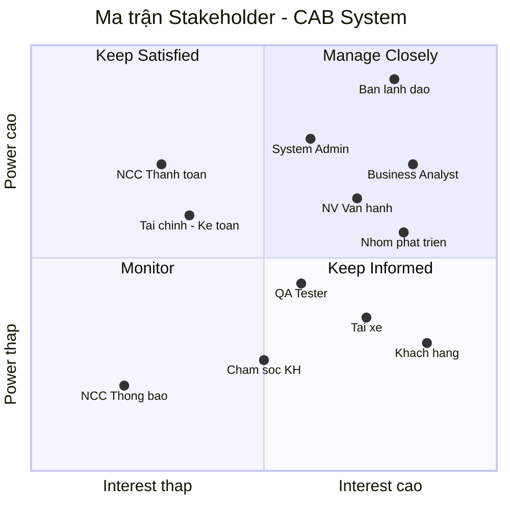
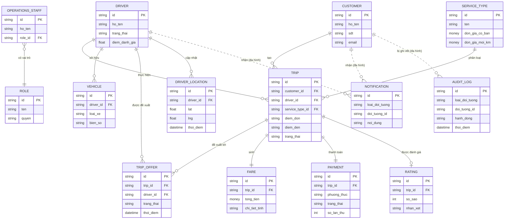
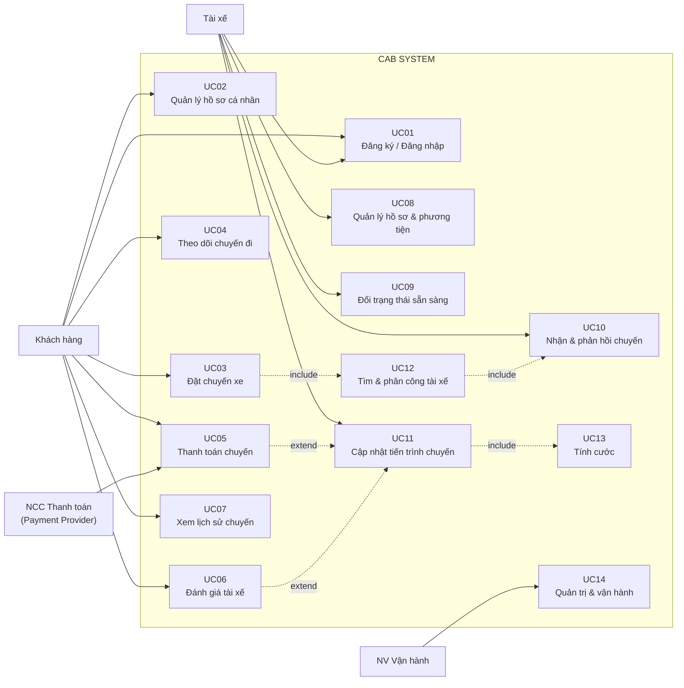

# SRS — Nền tảng đặt xe CAB

## Bước 1: Đọc và phân tích yêu cầu khách hàng ở giai đoạn sơ khởi (Business Context & Business Problem)

### 1.1 Ngữ cảnh nghiệp vụ (Business Context)

Công ty ABC cung cấp dịch vụ đặt xe trực tuyến. Hiện trạng: khách đặt xe qua **tổng đài** hoặc một **ứng dụng đơn giản**, điều phối phía sau **chủ yếu thủ công**. Ban lãnh đạo không muốn “vá” ứng dụng cũ mà xây một **nền tảng CAB mới**, phục vụ được số lượng lớn khách hàng và tài xế, và **mở rộng thêm tính năng trong tương lai** (loại dịch vụ, phương thức thanh toán, kênh thông báo…) mà không phải xây lại toàn bộ.

Các yếu tố định hình ngữ cảnh:

- **Ba nhóm người dùng chính:** Khách hàng, Tài xế, Nhân viên vận hành
- **Phụ thuộc bên ngoài:** nhà cung cấp thanh toán và (tương lai) nhà cung cấp thông báo — hệ thống tích hợp chứ không tự xử lý mọi thứ.

### 1.2 Vấn đề nghiệp vụ (Business Problem)

Vấn đề: hệ thống hiện tại vừa thủ công vừa thiếu tính module/khả năng mở rộng. Đây là lý do tài liệu nhấn mạnh yêu cầu phi chức năng: các thành phần (thanh toán, thông báo…) phải mở rộng độc lập, và một lỗi ở thanh toán/thông báo không được làm sập luồng đặt xe. Bài toán không chỉ là “làm app đặt xe” mà là “làm một nền tảng chịu tải, tách rời và dễ tiến hóa”.

| \#  | Vấn đề hiện tại                      | Hệ quả nghiệp vụ                                                   |
|-----|--------------------------------------|--------------------------------------------------------------------|
| 1   | Phân công tài xế thủ công            | Chậm, dễ sai, không phục vụ được số lượng lớn, phụ thuộc con người |
| 2   | Khách khó theo dõi trạng thái chuyến | Trải nghiệm kém, gọi tổng đài nhiều, mất niềm tin                  |
| 3   | Thông tin thanh toán không tập trung | Khó đối soát, khó báo cáo doanh thu, khó kiểm toán                 |
| 4   | Bộ phận vận hành khó mở rộng         | Không chịu tải lúc cao điểm, tăng trưởng bị nghẽn                  |
| 5   | Khó thêm tính năng mới               | Kiến trúc cứng, mỗi thay đổi ảnh hưởng toàn hệ thống               |

## Bước 2: Xác định stakeholder & vẽ ma trận stakeholder

| Tên Stakeholder                                    | Vai trò trong hệ thống                                                                                            |
|----------------------------------------------------|-------------------------------------------------------------------------------------------------------------------|
| **Khách hàng (Customer)**                          | Đăng ký/đăng nhập, nhập điểm đón–đến, chọn loại xe, gửi yêu cầu, theo dõi chuyến, thanh toán, đánh giá tài xế.    |
| **Tài xế (Driver)**                                | Cập nhật hồ sơ/phương tiện, chuyển trạng thái sẵn sàng, nhận/từ chối chuyến, cập nhật tiến trình và vị trí.       |
| **Nhân viên vận hành (Operations Staff)**          | Quản trị khách hàng, tài xế, phương tiện, chuyến; theo dõi chuyến đang chạy, xử lý chuyến lỗi, tra cứu giao dịch. |
| **Quản trị viên hệ thống (System Admin)**          | Phân quyền, cấu hình, thao tác nhạy cảm, quản lý lưu vết (audit) và an toàn hệ thống.                             |
| **Ban lãnh đạo (Executive)**                       | Đặt tầm nhìn, phê duyệt phạm vi & ngân sách, theo dõi báo cáo doanh thu, tỷ lệ hoàn thành/hủy, hiệu quả tài xế.   |
| **Tài chính – Kế toán (Finance)**                  | Đối soát thanh toán, quản lý doanh thu tập trung, lập báo cáo tài chính.                                          |
| **Chăm sóc khách hàng (Customer Support)**         | Hỗ trợ khách qua hotline, tiếp nhận & xử lý khiếu nại, hỗ trợ sự cố chuyến.                                       |
| **Business Analyst (BA)**                          | Thu thập & làm rõ yêu cầu, xác định phạm vi/quy tắc/ngoại lệ, cầu nối giữa khách hàng và nhóm phát triển.         |
| **Nhóm phát triển (Dev Team)**                     | Thiết kế kiến trúc, xây dựng, tích hợp các thành phần.                                                            |
| **QA / Kiểm thử (Tester)**                         | Kiểm thử chức năng & phi chức năng, đảm bảo chất lượng, độ ổn định lúc cao điểm.                                  |
| **Nhà cung cấp thanh toán (Payment Provider)**     | Đối tác ngoài xử lý giao dịch điện tử; CAB **không lưu** thông tin thẻ/tài khoản nhạy cảm.                        |
| **Nhà cung cấp thông báo (Notification Provider)** | Đối tác ngoài gửi SMS/Push/Email; kiến trúc phải cho phép mở rộng kênh sau này.                                   |

*Sơ đồ 1 — Ma trận Stakeholder*

## Bước 3: Xác định business goal (mục đích)

| Mã       | Business Goal                            | Mục đích                                                                                                                                                                                                        |
|----------|------------------------------------------|-----------------------------------------------------------------------------------------------------------------------------------------------------------------------------------------------------------------|
| **BG01** | Giảm thời gian tìm tài xế                | Tự động tìm & ghép tài xế phù hợp theo vị trí và trạng thái sẵn sàng (thay phân công thủ công); ưu tiên tài xế gần & phù hợp và tự chuyển tài xế khác khi bị từ chối/không phản hồi mà không bắt khách tạo lại. |
| **BG02** | Hỗ trợ thanh toán linh hoạt              | Cho phép thanh toán tiền mặt hoặc trực tuyến, tích hợp cổng ngoài mà không lưu dữ liệu thẻ nhạy cảm.                                                                                                            |
| **BG03** | Tăng khả năng theo dõi chuyến đi         | Cho khách theo dõi trạng thái chuyến: đang tìm tài xế, tài xế đã nhận, ETA, tiến trình chuyến.                                                                                                                  |
| **BG04** | Quản lý thanh toán & doanh thu tập trung | Tập trung dữ liệu giao dịch để đối soát, xác định cước theo loại dịch vụ, báo cáo doanh thu chính xác.                                                                                                          |
| **BG05** | Thông báo đa kênh, dễ mở rộng            | Gửi thông báo cho khách & tài xế ở các mốc quan trọng; kiến trúc cho phép thêm kênh mới.                                                                                                                        |
| **BG06** | Cung cấp công cụ vận hành & quản trị     | Giao diện quản trị để quản lý khách/tài xế/phương tiện/chuyến và xử lý chuyến lỗi.                                                                                                                              |
| **BG07** | Hỗ trợ ra quyết định bằng báo cáo        | Báo cáo số chuyến, doanh thu, tỷ lệ hoàn thành/hủy, hiệu quả tài xế cho ban lãnh đạo.                                                                                                                           |
| **BG08** | Đảm bảo độ ổn định khi tải cao           | Giữ hệ thống ổn định lúc cao điểm; lỗi thanh toán/thông báo không làm sập luồng đặt xe.                                                                                                                         |
| **BG09** | Bảo mật & phân quyền                     | Xác thực người dùng, kiểm soát quyền cho thao tác quản trị, bảo vệ dữ liệu cá nhân/vị trí/giao dịch.                                                                                                            |
| **BG10** | Lưu vết phục vụ kiểm tra                 | Ghi log thao tác quan trọng để truy vết và điều tra khi có sự cố.                                                                                                                                               |

## Bước 4: Xác định phạm vi (scope)

### A. Trong phạm vi 

| Mã      | Module                  | Chức năng cốt lõi                                                                                    |
|---------|-------------------------|------------------------------------------------------------------------------------------------------|
| **M01** | Quản lý khách hàng      | Đăng ký, đăng nhập, cập nhật thông tin, xem lịch sử chuyến.                                          |
| **M02** | Quản lý tài xế          | Tạo/đăng ký tài khoản, cập nhật hồ sơ & phương tiện, chuyển trạng thái sẵn sàng.                     |
| **M03** | Đặt xe (Booking)        | Nhập điểm đón–đến, chọn loại xe, gửi yêu cầu, tạo chuyến.                                            |
| **M04** | Ghép & phân công tài xế | Tự tìm tài xế theo vị trí & trạng thái; chuyển tài xế khác khi bị từ chối/không phản hồi.            |
| **M05** | Quản lý chuyến đi       | Cập nhật trạng thái: đã đến điểm đón, đã đón khách, đang di chuyển, hoàn thành.                      |
| **M06** | Tính cước & Thanh toán  | Tính tiền theo loại dịch vụ; thanh toán tiền mặt hoặc điện tử qua cổng ngoài; xử lý thất bại.        |
| **M07** | Thông báo               | Gửi thông báo cho khách & tài xế tại các mốc chính.                                                  |
| **M08** | Quản trị & vận hành     | Giao diện nhân viên quản lý khách/tài xế/phương tiện/chuyến; xem chuyến đang chạy, xử lý chuyến lỗi. |
| **M09** | Xác thực & phân quyền   | Xác thực người dùng; kiểm soát quyền cho thao tác quản trị.                                          |
| **M10** | Đánh giá sau chuyến     | Cho khách đánh giá tài xế sau khi hoàn thành chuyến.                                                 |

**Mức ưu tiên:**

- **Must-have (bắt buộc cho demo):** M01, M02, M03, M04, M05, **M06 (nhánh tiền mặt)**, M07, M09.
- **Should-have:** M06 (nhánh điện tử), M08 (bản tối giản), M10.

> **Ghi chú:** M06 nhánh điện tử làm ở dạng **mock provider** (trả success/fail để test), M07 **ghi log/in ra** thay vì tích hợp SMS/Push thật, M08 chỉ làm màn hình **xem danh sách chuyến + trạng thái tài xế** tối thiểu. Chi tiết ở Bước 4c

### B. Ngoài phạm vi ở MVP

| Hạng mục ngoài phạm vi                             | Lý do chưa làm                                                                              |
|----------------------------------------------------|---------------------------------------------------------------------------------------------|
| Báo cáo & phân tích nâng cao (BG07)                | Kỳ vọng dài hạn, không thuộc luồng lõi; để phase sau.                                       |
| Bản đồ định vị realtime & ETA chính xác            | Cần dữ liệu vị trí liên tục + tính toán phức tạp; MVP chỉ lưu vị trí cơ bản để ghép tài xế. |
| Đa dạng loại dịch vụ / nhiều gói cước phức tạp     | Cách tính cước dùng công thức mặc định; chỉ làm 1–2 loại cơ bản.                            |
| Tích hợp nhiều nhà cung cấp thanh toán / thông báo | MVP: 1 cổng thanh toán (mock) + 1 kênh thông báo (log); kiến trúc chừa chỗ mở rộng.         |
| Khuyến mãi, mã giảm giá, ví nội bộ, điểm thưởng    | Không có trong yêu cầu → ngoài phạm vi.                                                     |
| App di động native hoàn chỉnh                      | MVP tập trung luồng nghiệp vụ & demo.                                                       |
| Auto-scaling / HA đầy đủ                           | MVP đảm bảo kiến trúc tách rời/module hóa; tối ưu tải thực làm ở giai đoạn scale-up.        |

### C. Chiến lược cắt phạm vi (Build vs. Mock)

| Thành phần         | Cách làm trong MVP                                                             | Vẫn nghiệm thu được gì                          |
|--------------------|--------------------------------------------------------------------------------|-------------------------------------------------|
| Thanh toán điện tử | **Mock provider** trả success/fail theo cấu hình                               | Cơ chế retry + fallback tiền mặt (EX03/AC10)    |
| Thông báo (M07)    | **Ghi log / in ra** ở các mốc, không gửi SMS/Push thật                         | Đúng thời điểm & nội dung thông báo (AC33–AC34) |
| Vị trí tài xế      | Nhập tay toạ độ / chọn từ danh sách, không GPS realtime                        | Ghi nhận vị trí phục vụ ghép tài xế (AC35)      |
| Admin (M08)        | Chỉ màn hình xem danh sách chuyến + trạng thái tài xế                          | Vận hành theo dõi & phát hiện chuyến lỗi (AC36) |
| Audit (BR20)       | Log cơ bản cho thao tác nhạy cảm                                               | Mỗi thao tác nhạy cảm sinh log (AC37)           |
| Hủy chuyến (BR21)  | Chỉ làm nhánh **hủy miễn phí khi đang tìm tài xế**; phí hủy để config, làm sau | Cơ chế hủy + áp chính sách (AC38–AC39)          |
| Offline (EX09)     | Grace 60s ở mức xử lý lại/đồng bộ đơn giản                                     | Không mất trạng thái khi rớt mạng ngắn (AC40)   |
| Retention (NFR13)  | Chỉ đặt tham số ở config; job dọn dữ liệu tự động làm sau                      | Giá trị lưu trữ có ở cấu hình (AC41)            |

### D. Những điểm chưa xác định chi tiết trong MVP (cần xác nhận với khách hàng)

| \#  | Điểm chưa chốt                        | Trạng thái                                                                                    | Câu hỏi cho khách hàng                                                   |
|-----|---------------------------------------|-----------------------------------------------------------------------------------------------|--------------------------------------------------------------------------|
| 1   | Cách tính cước                        | Có default (12k + 10k/km)                                                                     | Biểu giá chính thức? Có phụ phí giờ cao điểm/quãng đường tối thiểu?      |
| 2   | Tiêu chí ưu tiên tài xế               | Có default (gần nhất → đánh giá cao)                                                          | Có thêm tiêu chí (tỷ lệ nhận chuyến, thời gian chờ của tài xế)?          |
| 3   | Thời gian tài xế phản hồi             | Có default (20 giây)                                                                          | Ngưỡng chính thức? Khác nhau theo khung giờ?                             |
| 4   | Chính sách hủy chuyến & phí hủy       | Có default (miễn phí trước khi có tài xế; 10.000đ khi chưa đón khách; chặn sau khi đón khách) | Mức phí chính thức? Có phí hủy phía tài xế? Có giới hạn số lần hủy/ngày? |
| 5   | Xử lý mất kết nối mạng (EX09)         | Có default (grace 60 giây, đồng bộ lại khi online)                                            | Grace period chính thức? Quá hạn thì tự hủy hay giữ *cần vận hành*?      |
| 6   | Thời gian lưu trữ dữ liệu (retention) | Có default (chuyến/giao dịch 12 tháng, vị trí 30 ngày, audit 12 tháng)                        | Có ràng buộc pháp lý/kiểm toán buộc lưu lâu hơn?                         |
| 7   | Điều kiện dừng vòng ghép (EX01)       | Có default (tối đa 5 ứng viên **hoặc** 120 giây)                                              | Số ứng viên / tổng thời gian chính thức?                                 |
| 8   | Số lần retry thanh toán điện tử       | Có default (2 lần → tiền mặt)                                                                 | Số lần chính thức? Sau fallback có cho thử lại điện tử không?            |

## Bước 5: Chuyển thành business requirement (BR)

| Mã       | Tên Business Requirement                | Diễn giải                                                                                                     |
|----------|-----------------------------------------|---------------------------------------------------------------------------------------------------------------|
| **BR01** | Đăng ký & quản lý tài khoản khách hàng  | Khách đăng ký, đăng nhập, cập nhật thông tin, xem lịch sử chuyến.                                             |
| **BR02** | Đăng ký & quản lý tài khoản tài xế      | Tài xế tự đăng ký hoặc được nhân viên tạo, cập nhật hồ sơ & phương tiện.                                      |
| **BR03** | Quản lý trạng thái hoạt động tài xế     | Tài xế chuyển trạng thái sẵn sàng/không sẵn sàng khi đang làm việc.                                           |
| **BR04** | Đặt chuyến xe                           | Khách nhập điểm đón–đến, chọn loại xe, gửi yêu cầu để tạo chuyến.                                             |
| **BR05** | Tự động tìm & phân công tài xế          | Hệ thống tìm tài xế theo vị trí & trạng thái, ưu tiên tài xế gần khách.                                       |
| **BR06** | Xử lý khi tài xế từ chối/không phản hồi | Tự tìm tài xế khác không bắt khách tạo lại; hết tài xế thì thông báo rõ.                                      |
| **BR07** | Chấp nhận / từ chối chuyến              | Tài xế nhận thông báo chuyến mới, chấp nhận hoặc từ chối.                                                     |
| **BR08** | Theo dõi trạng thái chuyến đi           | Khách theo dõi: đang tìm tài xế, tài xế đã nhận, ETA, trạng thái hiện tại.                                    |
| **BR09** | Cập nhật tiến trình chuyến              | Tài xế cập nhật: đã đến điểm đón, đã đón khách, đang di chuyển, hoàn thành.                                   |
| **BR10** | Lưu vị trí tài xế                       | Lưu vị trí tài xế để tìm tài xế gần và ước lượng thời gian đến.                                               |
| **BR11** | Tính cước chuyến đi                     | Sau khi hoàn thành, xác định số tiền theo loại dịch vụ & thông tin chuyến.                                    |
| **BR12** | Thanh toán chuyến đi                    | Khách thanh toán tiền mặt hoặc điện tử; tích hợp provider ngoài, không lưu thẻ nhạy cảm.                      |
| **BR13** | Xử lý thanh toán thất bại               | Điện tử thất bại → thông báo khách & cho xử lý lại theo chính sách.                                           |
| **BR14** | Gửi thông báo cho khách hàng            | Thông báo tại các mốc: tiếp nhận, có tài xế, đến điểm đón, hoàn thành, kết quả thanh toán.                    |
| **BR15** | Gửi thông báo cho tài xế                | Thông báo chuyến mới & thay đổi của chuyến đang thực hiện.                                                    |
| **BR16** | Đánh giá tài xế sau chuyến              | Khách đánh giá tài xế sau khi chuyến hoàn thành.                                                              |
| **BR17** | Quản trị & vận hành                     | Nhân viên quản lý khách/tài xế/phương tiện/chuyến, xem chuyến đang chạy, xử lý chuyến lỗi, tra cứu giao dịch. |
| **BR18** | Phân quyền thao tác quản trị            | Chức năng nhạy cảm chỉ dành cho vai trò được cấp quyền.                                                       |
| **BR19** | Xác thực người dùng                     | Khách & tài xế phải xác thực trước khi dùng chức năng cần tài khoản.                                          |
| **BR20** | Lưu vết thao tác quan trọng (audit)     | Ghi log thao tác quan trọng phục vụ truy vết.                                                                 |
| **BR21** | Hủy chuyến                              | Khách (hoặc tài xế) hủy chuyến theo chính sách phí hủy & mốc cho phép hủy.                                    |

## Bước 6: Xây dựng business process

### BP01 – Đặt chuyến & tìm tài xế (quy trình lõi)

1.  Khách đăng nhập, nhập **điểm đón + điểm đến**, chọn **loại xe**.
2.  Gửi yêu cầu → hệ thống **tạo chuyến** (trạng thái: *đang tìm tài xế*).
3.  Hệ thống **xác nhận tiếp nhận** và thông báo cho khách.
4.  Hệ thống **tìm tài xế** theo vị trí, trạng thái sẵn sàng, ưu tiên gần khách (bán kính **1 km – default**).
5.  Gửi đề xuất tới tài xế → tài xế **chấp nhận hoặc từ chối** trong **20 giây (default)**.
6.  **Chấp nhận** → gán tài xế, thông báo khách (tài xế đã nhận + ETA).
7.  **Từ chối / hết giờ** → tự tìm tài xế kế tiếp (không bắt khách tạo lại).
8.  **Hết tài xế** → thông báo rõ “không tìm được tài xế”.

### BP02 – Thực hiện chuyến đi

1.  Tài xế đến điểm đón → cập nhật **“đã đến điểm đón”** → thông báo khách.
2.  Đón khách → **“đã đón khách”**.
3.  **“đang di chuyển”** suốt hành trình.
4.  Tới đích → **“hoàn thành chuyến”** → chuyển sang tính cước.

### BP03 – Tính cước & thanh toán

1.  Chuyến hoàn thành → **tính cước** = **12.000đ + 10.000đ/km (default)** theo loại dịch vụ.
2.  Khách chọn **tiền mặt** hoặc **điện tử**.
3.  Tiền mặt → xác nhận đã thanh toán.
4.  Điện tử → gọi **provider ngoài** (không lưu thẻ nhạy cảm).
    - Thành công → cập nhật kết quả, thông báo khách.
    - Thất bại → **thử lại tối đa 2 lần (default)**; vẫn lỗi → **chuyển tiền mặt** + thông báo khách.
5.  Sau thanh toán → khách **đánh giá tài xế**.

### BP04 – Quản trị & xử lý sự cố (vận hành)

1.  Nhân viên xem **danh sách chuyến đang diễn ra** và trạng thái tài xế.
2.  Khi có **chuyến lỗi**, kiểm tra và hỗ trợ xử lý.
3.  Tra cứu **lịch sử giao dịch** khi cần.
4.  Thao tác nhạy cảm phải qua **kiểm tra phân quyền**; mọi thao tác quan trọng được **lưu vết (audit)**.

## Bước 7: Phân rã yêu cầu nghiệp vụ (FR)

| BR       | FR   | Chức năng (mức hệ thống)                                                                                                                |
|----------|------|-----------------------------------------------------------------------------------------------------------------------------------------|
| **BR01** | FR01 | Đăng ký tài khoản khách hàng                                                                                                            |
|          | FR02 | Đăng nhập / cấp phiên                                                                                                                   |
|          | FR03 | Cập nhật thông tin cá nhân                                                                                                              |
|          | FR04 | Xem lịch sử chuyến đi                                                                                                                   |
| **BR02** | FR05 | Tạo tài khoản tài xế (tự đăng ký / NV tạo)                                                                                              |
|          | FR06 | Cập nhật hồ sơ tài xế                                                                                                                   |
|          | FR07 | Cập nhật thông tin phương tiện                                                                                                          |
| **BR03** | FR08 | Đổi trạng thái sẵn sàng / không sẵn sàng                                                                                                |
| **BR04** | FR09 | Nhập & chuẩn hoá điểm đón, điểm đến                                                                                                     |
|          | FR10 | Chọn loại xe / loại dịch vụ                                                                                                             |
|          | FR11 | Gửi yêu cầu & tạo chuyến (trạng thái *đang tìm tài xế*)                                                                                 |
| **BR05** | FR12 | Xác định vị trí khách hàng (điểm đón)                                                                                                   |
|          | FR13 | Lọc tài xế online/sẵn sàng trong **bán kính 1 km (default)**                                                                            |
|          | FR14 | Lọc tài xế theo loại xe khách chọn                                                                                                      |
|          | FR15 | Xếp ưu tiên: **gần nhất; hòa → đánh giá cao hơn (default)**                                                                             |
|          | FR16 | Chọn tài xế ứng viên đầu danh sách                                                                                                      |
| **BR06** | FR17 | Gửi đề xuất chuyến tới tài xế                                                                                                           |
|          | FR18 | Chờ phản hồi trong **timeout 20 giây (default)**                                                                                        |
|          | FR19 | Từ chối/hết giờ → chọn tài xế kế tiếp (không bắt khách tạo lại)                                                                         |
|          | FR20 | Hết tài xế → thông báo khách “không tìm được tài xế”                                                                                    |
| **BR07** | FR21 | Tài xế nhận thông báo chuyến mới                                                                                                        |
|          | FR22 | Tài xế chấp nhận / từ chối                                                                                                              |
|          | FR23 | Gán tài xế vào chuyến khi chấp nhận                                                                                                     |
| **BR08** | FR24 | Truy vấn trạng thái chuyến hiện tại                                                                                                     |
|          | FR25 | Cung cấp thời gian dự kiến đến (ETA)                                                                                                    |
| **BR09** | FR26 | Cập nhật “đã đến điểm đón”                                                                                                              |
|          | FR27 | Cập nhật “đã đón khách”                                                                                                                 |
|          | FR28 | Cập nhật “đang di chuyển”                                                                                                               |
|          | FR29 | Cập nhật “hoàn thành chuyến”                                                                                                            |
| **BR10** | FR30 | Ghi nhận & cập nhật vị trí tài xế                                                                                                       |
| **BR11** | FR31 | Tính cước = **12.000đ + 10.000đ/km (default)** theo loại dịch vụ                                                                        |
| **BR12** | FR32 | Cho khách chọn tiền mặt / điện tử                                                                                                       |
|          | FR33 | Xác nhận thanh toán tiền mặt                                                                                                            |
|          | FR34 | Gọi cổng thanh toán ngoài (không lưu thông tin thẻ) – loại điện tử                                                                      |
| **BR13** | FR35 | Nhận kết quả giao dịch (thành công/thất bại)                                                                                            |
|          | FR36 | Thất bại → **thử lại 2 lần → chuyển tiền mặt (default)**                                                                                |
| **BR14** | FR37 | TB khách: tiếp nhận yêu cầu                                                                                                             |
|          | FR38 | TB khách: có tài xế nhận                                                                                                                |
|          | FR39 | TB khách: tài xế đến điểm đón                                                                                                           |
|          | FR40 | TB khách: hoàn thành chuyến                                                                                                             |
|          | FR41 | TB khách: kết quả thanh toán                                                                                                            |
| **BR15** | FR42 | TB tài xế: chuyến mới                                                                                                                   |
|          | FR43 | TB tài xế: thay đổi của chuyến đang chạy                                                                                                |
| **BR16** | FR44 | Cho khách đánh giá tài xế sau chuyến                                                                                                    |
| **BR17** | FR45 | Quản lý (CRUD) khách/tài xế/xe/chuyến                                                                                                   |
|          | FR46 | Xem chuyến đang diễn ra + trạng thái tài xế                                                                                             |
|          | FR47 | Hỗ trợ xử lý chuyến bị lỗi                                                                                                              |
|          | FR48 | Tra cứu lịch sử giao dịch                                                                                                               |
| **BR18** | FR49 | Kiểm tra phân quyền cho thao tác nhạy cảm                                                                                               |
| **BR19** | FR50 | Xác thực người dùng trước chức năng cần tài khoản                                                                                       |
| **BR20** | FR51 | Ghi log lưu vết thao tác quan trọng                                                                                                     |
| **BR21** | FR52 | Cho phép hủy chuyến (kiểm tra mốc cho phép hủy theo trạng thái)                                                                         |
|          | FR53 | Áp phí hủy theo chính sách: **miễn phí trước khi có tài xế; 10.000đ khi đã có tài xế chưa đón khách; chặn sau khi đón khách (default)** |
| — chung  | FR54 | Xử lý mất kết nối: cho reconnect trong **60 giây (default)**, đồng bộ trạng thái khi online                                             |

## Bước 8: Xây dựng business rule & exception

### A. Business Rules (RULE)

| Mã         | Quy tắc nghiệp vụ                                                                                                                                                                    | FR liên quan    |
|------------|--------------------------------------------------------------------------------------------------------------------------------------------------------------------------------------|-----------------|
| **RULE01** | Chỉ tài xế ở trạng thái sẵn sàng (available) mới được đề xuất bắt chuyến.                                                                                                            | FR08, FR13      |
| **RULE02** | Tài xế chỉ đổi sang sẵn sàng khi đang trong ca làm việc.                                                                                                                             | FR08            |
| **RULE03** | Một tài xế không được gán hai chuyến cùng lúc.                                                                                                                                       | FR13, FR23      |
| **RULE04** | Khi tìm tài xế, chỉ xét tài xế trong **bán kính 1 km (default)** và đúng loại xe.                                                                                                    | FR13, FR14      |
| **RULE05** | Ưu tiên **gần nhất**; hòa khoảng cách → **đánh giá cao hơn (default)**.                                                                                                              | FR15            |
| **RULE06** | Tài xế phải phản hồi trong **20 giây (default)**; quá hạn = từ chối.                                                                                                                 | FR17, FR18      |
| **RULE07** | Tài xế từ chối/hết giờ → tự chuyển tài xế kế tiếp, không bắt khách tạo lại.                                                                                                          | FR19            |
| **RULE08** | Trạng thái chuyến đi đúng thứ tự: đến điểm đón → đón khách → di chuyển → hoàn thành.                                                                                                 | FR26–FR29       |
| **RULE09** | Cước tính sau khi hoàn thành = **12.000đ + 10.000đ/km (default)**.                                                                                                                   | FR31            |
| **RULE10** | Không lưu thông tin thẻ/tài khoản nhạy cảm; điện tử xử lý qua provider ngoài.                                                                                                        | FR34            |
| **RULE11** | Khách chỉ đánh giá tài xế sau khi chuyến hoàn thành.                                                                                                                                 | FR44            |
| **RULE12** | Thao tác quản trị nhạy cảm chỉ dành cho vai trò được cấp quyền.                                                                                                                      | FR49            |
| **RULE13** | Khách & tài xế phải xác thực trước khi dùng chức năng cần tài khoản.                                                                                                                 | FR50            |
| **RULE14** | Mọi thao tác quan trọng phải ghi log (audit).                                                                                                                                        | FR51            |
| **RULE15** | Lỗi thanh toán/thông báo không được làm sập luồng đặt xe; các thành phần độc lập.                                                                                                    | FR34, FR37–FR43 |
| **RULE16** | Khách chỉ xem dữ liệu của chính mình (chuyến, lịch sử, trạng thái).                                                                                                                  | FR04, FR24      |
| **RULE17** | Hủy chuyến: **miễn phí khi còn *đang tìm tài xế*; đã có tài xế mà chưa đón khách → phí 10.000đ; đã đón khách → không cho hủy (default)**.                                            | FR52, FR53      |
| **RULE18** | Mất kết nối ≤ **60 giây (default)** → giữ nguyên trạng thái, đồng bộ lại khi online (last-write-wins theo timestamp); quá hạn khi đang chạy chuyến → đánh dấu *cần vận hành* (EX04). | FR54            |
| **RULE19** | Lưu trữ (default): chuyến & giao dịch **12 tháng**, vị trí tài xế **30 ngày**, audit **12 tháng**; sau đó archive/xoá theo chính sách.                                               | FR51, FR30      |

### B. Exceptions (EX) – khác gì so với business rule

| Mã       | Tình huống                                                       | Cách xử lý                                                                                                                                                                                                                         |
|----------|------------------------------------------------------------------|------------------------------------------------------------------------------------------------------------------------------------------------------------------------------------------------------------------------------------|
| **EX01** | Không tìm được tài xế (hết ứng viên / đợi lâu).                  | Dừng vòng tìm khi **đã thử 5 tài xế HOẶC quá 120 giây (default)**, cái nào đến trước; thông báo rõ “không tìm được tài xế”.                                                                                                        |
| **EX02** | Tài xế được đề xuất từ chối hoặc không phản hồi.                 | Loại tài xế đó, tự chọn tài xế kế tiếp (RULE07).                                                                                                                                                                                   |
| **EX03** | Thanh toán điện tử thất bại.                                     | **Thử lại 2 lần → chuyển tiền mặt (default)** + thông báo khách.                                                                                                                                                                   |
| **EX04** | Nhân viên phát hiện chuyến bị lỗi (kẹt trạng thái, sai dữ liệu). | Nhân viên vận hành kiểm tra & hỗ trợ xử lý qua giao diện quản trị.                                                                                                                                                                 |
| **EX05** | Thành phần thông báo lỗi (không gửi được).                       | Không gián đoạn luồng đặt xe (RULE15); ghi nhận để xử lý lại/mở rộng kênh sau.                                                                                                                                                     |
| **EX06** | Người dùng chưa xác thực gọi chức năng cần tài khoản.            | Từ chối truy cập, yêu cầu đăng nhập (RULE13).                                                                                                                                                                                      |
| **EX07** | Nhân viên thường cố thực hiện thao tác nhạy cảm.                 | Kiểm tra phân quyền và từ chối (RULE12), ghi log.                                                                                                                                                                                  |
| **EX08** | Tài xế cập nhật trạng thái sai thứ tự vòng đời.                  | Từ chối cập nhật không hợp lệ, giữ đúng trình tự (RULE08).                                                                                                                                                                         |
| **EX09** | Mất kết nối mạng giữa chuyến (khách/tài xế offline).             | Cho reconnect trong **60 giây (default)**, giữ nguyên trạng thái & đồng bộ lại khi online; quá hạn khi đang chạy chuyến → đánh dấu *cần vận hành* (RULE18, EX04).                                                                  |
| **EX10** | Khách/tài xế hủy chuyến.                                         | Áp chính sách RULE17: miễn phí khi *đang tìm tài xế*; phí **10.000đ (default)** khi đã có tài xế chưa đón khách; chặn hủy sau khi *đã đón khách*. Tài xế hủy sau khi nhận → chuyến quay lại vòng tìm (EX02), không tính phí khách. |

## Bước 9: Xây dựng data modelling & vẽ sơ đồ ERD

### A. Thực thể (Entity)

| Thực thể             | Ý nghĩa                                               | Bám BR           |
|----------------------|-------------------------------------------------------|------------------|
| **CUSTOMER**         | Khách hàng đặt xe                                     | BR01             |
| **DRIVER**           | Tài xế (hồ sơ + trạng thái + điểm đánh giá)           | BR02, BR03       |
| **VEHICLE**          | Phương tiện gắn với tài xế                            | BR02             |
| **SERVICE_TYPE**     | Loại dịch vụ / loại xe (cơ sở tính cước)              | BR04, BR11       |
| **TRIP**             | Chuyến đi — thực thể trung tâm                        | BR04, BR08, BR09 |
| **TRIP_OFFER**       | Lượt đề xuất chuyến cho tài xế (nhận/từ chối/timeout) | BR05, BR06, BR07 |
| **FARE**             | Cước tính cho chuyến                                  | BR11             |
| **PAYMENT**          | Giao dịch thanh toán của chuyến                       | BR12, BR13       |
| **RATING**           | Đánh giá của khách cho tài xế sau chuyến              | BR16             |
| **DRIVER_LOCATION**  | Vị trí tài xế theo thời gian                          | BR10             |
| **NOTIFICATION**     | Thông báo gửi cho khách/tài xế                        | BR14, BR15       |
| **OPERATIONS_STAFF** | Nhân viên vận hành / quản trị                         | BR17             |
| **ROLE**             | Vai trò & quyền (phân quyền)                          | BR18             |
| **AUDIT_LOG**        | Lưu vết thao tác quan trọng                           | BR20             |

### B. Sơ đồ ERD

> **Lưu ý đọc sơ đồ:** `NOTIFICATION`, `DRIVER_LOCATION` và `AUDIT_LOG` được nối bằng quan hệ **đứt nét mang tính tham chiếu**. `NOTIFICATION` và `AUDIT_LOG` dùng cặp `(loai, id)` để trỏ **đa hình (polymorphic)** tới khách/tài xế/nhân viên nên **không** đặt FK cứng — đó là chủ ý thiết kế, không phải thiếu sót. – tại sao dùng quan hệ đa hình

Sơ đồ 2 — ERD

### C. Giải thích quan hệ chính

Thực thể trung tâm là **TRIP**: một **CUSTOMER** tạo nhiều **TRIP**; một **DRIVER** thực hiện nhiều **TRIP**; mỗi **TRIP** thuộc một **SERVICE_TYPE** (cơ sở tính cước ở FR31).

Quá trình ghép tài xế mô hình hóa bằng **TRIP_OFFER**: một chuyến được đề xuất lần lượt tới nhiều tài xế, mỗi lượt có trạng thái offered/accepted/rejected/timeout — chỗ lưu vết cho quy tắc “từ chối thì chuyển tài xế kế tiếp” (RULE07/FR19) mà không cần khách tạo lại yêu cầu.

Mỗi **TRIP** hoàn thành sinh đúng một **FARE** và một **PAYMENT** (1–1), và 0 hoặc 1 **RATING**. **DRIVER_LOCATION** lưu vị trí tài xế theo thời gian phục vụ tìm tài xế gần (FR13) và ETA (FR25). **NOTIFICATION** và **AUDIT_LOG** dùng quan hệ đa hình như đã nêu ở phần B.

### D. Lưu ý

Trường `SERVICE_TYPE.don_gia_co_ban = 12.000đ` và `don_gia_moi_km = 10.000đ` là **giá trị mặc định (default)**; `FARE.chi_tiet_tinh` lưu vết công thức áp dụng cho từng chuyến (phục vụ đối soát BG04). `PAYMENT.so_lan_thu` phục vụ chính sách retry (default 2 lần). Tất cả để cấu hình được.

Nhóm thực thể lõi cho MVP: CUSTOMER, DRIVER, VEHICLE, SERVICE_TYPE, TRIP, TRIP_OFFER, FARE, PAYMENT, RATING. Các thực thể NOTIFICATION, DRIVER_LOCATION, AUDIT_LOG, ROLE, OPERATIONS_STAFF có thể rút gọn tùy quỹ thời gian 7 tuần.

## Bước 10: Xác định & thiết kế non-functional requirement (NFR)

| Mã        | Nhóm                            | Yêu cầu                                                                      | Định hướng MVP (7 tuần)                                                                                                                                                 |
|-----------|---------------------------------|------------------------------------------------------------------------------|-------------------------------------------------------------------------------------------------------------------------------------------------------------------------|
| **NFR01** | Performance                     | Đáp ứng thao tác cơ bản trong thời gian hợp lý.                              | Bắt buộc (mức tối thiểu): không tối ưu độ trễ, chỉ cần đủ mượt cho demo.                                                                                                |
| **NFR02** | Scalability                     | Các thành phần mở rộng độc lập khi tải tăng.                                 | Bắt buộc (thiết kế tách rời theo module/dịch vụ); auto-scaling thật: định hướng tương lai.                                                                              |
| **NFR03** | Reliability / Fault Isolation   | Lỗi thanh toán/thông báo không làm sập luồng đặt xe.                         | Bắt buộc (MVP): tách thanh toán & thông báo khỏi luồng lõi, xử lý lỗi cục bộ.                                                                                           |
| **NFR04** | Availability                    | Hoạt động ổn định giờ cao điểm.                                              | Bắt buộc (mức ổn định cho demo); HA đầy đủ: định hướng tương lai (giai đoạn scale-up).                                                                                  |
| **NFR05** | Maintainability / Extensibility | Thêm dịch vụ/thanh toán/kênh thông báo mà không xây lại toàn bộ.             | Bắt buộc (MVP): abstraction/interface cho payment & notification.                                                                                                       |
| **NFR06** | Deployability                   | Triển khai chức năng mới từng phần.                                          | Bắt buộc (tách module rõ ràng); CI/CD đầy đủ: định hướng tương lai.                                                                                                     |
| **NFR07** | Authentication                  | Khách & tài xế xác thực trước khi dùng chức năng cần tài khoản.              | Bắt buộc (MVP): đăng nhập + phiên/token.                                                                                                                                |
| **NFR08** | Authorization                   | Thao tác quản trị nhạy cảm kiểm soát quyền theo vai trò.                     | Bắt buộc (MVP): phân quyền cơ bản.                                                                                                                                      |
| **NFR09** | Data Protection                 | Bảo vệ dữ liệu cá nhân/phương tiện/vị trí/giao dịch; không lưu thẻ nhạy cảm. | Bắt buộc (MVP): hash mật khẩu, điện tử qua provider ngoài.                                                                                                              |
| **NFR10** | Auditability                    | Ghi vết thao tác quan trọng.                                                 | Bắt buộc (mức cơ bản): log audit cho thao tác quản trị & giao dịch.                                                                                                     |
| **NFR11** | Resilience under load           | Không sụp đổ dây chuyền khi một thành phần quá tải.                          | Bắt buộc (mức thiết kế cơ bản): tách dịch vụ + hàng đợi cho tác vụ nền; chịu tải cao thực tế: định hướng tương lai.                                                     |
| **NFR12** | Configurability                 | Tham số nghiệp vụ để dạng cấu hình.                                          | Bắt buộc (MVP): bán kính, timeout, công thức cước, số lần retry, phí hủy, grace offline, retention ở config.                                                            |
| **NFR13** | Data Retention                  | Vòng đời & thời gian lưu trữ dữ liệu.                                        | Bắt buộc (đặt tham số ở config: chuyến & giao dịch 12 tháng, vị trí tài xế 30 ngày, audit 12 tháng); job dọn dữ liệu tự động: định hướng tương lai.                     |
| **NFR14** | Usability                       | Giao diện rõ ràng, dễ thao tác; thông báo trạng thái & lỗi dễ hiểu.          | Bắt buộc (mức tối thiểu cho demo): luồng đặt xe gọn (ít bước), hiển thị trạng thái chuyến & thông báo lỗi rõ ràng; chuẩn UX/accessibility đầy đủ: định hướng tương lai. |

## Bước 11: Vẽ Use Case (14 UC lõi – MVP)

### A. Danh sách Use Case (14 UC)

| Mã       | Use Case                    | Tác nhân chính   | FR liên quan     |
|----------|-----------------------------|------------------|------------------|
| **UC01** | Đăng ký / Đăng nhập         | Customer, Driver | FR01, FR02, FR05 |
| **UC02** | Quản lý hồ sơ cá nhân       | Customer         | FR03             |
| **UC03** | Đặt chuyến xe               | Customer         | FR09, FR10, FR11 |
| **UC04** | Theo dõi chuyến đi          | Customer         | FR24, FR25       |
| **UC05** | Thanh toán chuyến           | Customer         | FR32–FR36        |
| **UC06** | Đánh giá tài xế             | Customer         | FR44             |
| **UC07** | Xem lịch sử chuyến          | Customer         | FR04             |
| **UC08** | Quản lý hồ sơ & phương tiện | Driver           | FR06, FR07       |
| **UC09** | Đổi trạng thái sẵn sàng     | Driver           | FR08             |
| **UC10** | Nhận & phản hồi chuyến      | Driver           | FR21, FR22       |
| **UC11** | Cập nhật tiến trình chuyến  | Driver           | FR26–FR29        |
| **UC12** | Tìm & phân công tài xế      | System (từ UC03) | FR12–FR20, FR23  |
| **UC13** | Tính cước                   | System (từ UC11) | FR31             |
| **UC14** | Quản trị & vận hành         | Operations Staff | FR45–FR49, FR51  |

### B. Sơ đồ Use Case

*Sơ đồ 3 — Use Case (14 UC)*

Sơ đồ 3 — Use Case (14 UC)

### C. Quan hệ include/extend

Ba `include` cốt lõi: UC03 include UC12 (đặt xe kéo theo tìm tài xế), UC12 include UC10 (tìm tài xế phải qua bước tài xế phản hồi), UC11 include UC13 (hoàn thành chuyến thì tính cước). Hai `extend`: UC05 (thanh toán) và UC06 (đánh giá) mở rộng từ UC11 (sau khi chuyến hoàn thành). UC14 (quản trị & vận hành) độc lập, do nhân viên vận hành thực hiện. Hủy chuyến không tách thành use case riêng mà được xử lý như luồng ngoại lệ (EX10) theo quy tắc RULE17 gắn với FR52–FR53.

## Bước 12: Đặc tả Use Case (14 UC)

> Đặc tả chi tiết theo format: Actor chính / Mô tả / Business rule / Tiền–Hậu điều kiện / Luồng sự kiện chính & Luồng ngoại lệ (bảng Actor–Hệ thống).

### UC01 — Đăng ký / Đăng nhập

| Mục            | Nội dung                                                                                                                                                                                                                               |
|----------------|----------------------------------------------------------------------------------------------------------------------------------------------------------------------------------------------------------------------------------------|
| Mã use case    | UC01                                                                                                                                                                                                                                   |
| Tên            | Đăng ký / Đăng nhập (Customer, Driver) — gồm 2 luồng con: A. Đăng ký · B. Đăng nhập                                                                                                                                                    |
| Actor chính    | CUSTOMER, DRIVER                                                                                                                                                                                                                       |
| Mô tả          | Khách hàng và tài xế tạo tài khoản mới (luồng A) hoặc đăng nhập vào tài khoản đã có (luồng B) để dùng các chức năng cần tài khoản. Tài xế có thể tự đăng ký hoặc do nhân viên vận hành tạo.                                            |
| Business rule  | — Chung: Định danh (SĐT/email) là duy nhất; phải xác thực trước khi dùng chức năng cần tài khoản (RULE13). — Đăng ký: Tài xế tự đăng ký hoặc do NV vận hành tạo (FR05). — Đăng nhập: Khóa tài khoản sau N lần đăng nhập sai (default). |
| Tiền điều kiện | Luồng A: chưa có tài khoản với định danh này. Luồng B: đã có tài khoản, chưa đăng nhập.                                                                                                                                                |
| Hậu điều kiện  | Luồng A: tài khoản được tạo, sau đó tự động chuyển sang luồng B để cấp phiên. Luồng B: phiên (session/token) được cấp; vào được chức năng cần tài khoản.                                                                               |

**Luồng sự kiện chính**

***A. Đăng ký tài khoản mới***

| Actor                                                                | Hệ thống                                                 |
|----------------------------------------------------------------------|----------------------------------------------------------|
| 1\. Nhập thông tin đăng ký (định danh + mật khẩu + thông tin cơ bản) |                                                          |
| 2\. Gửi yêu cầu đăng ký                                              |                                                          |
|                                                                      | 3\. Kiểm tra định danh & thông tin hợp lệ (FR01/FR05)    |
|                                                                      | 4\. Tạo tài khoản                                        |
|                                                                      | 5\. Tự động chuyển sang luồng B (Đăng nhập) để cấp phiên |

***B. Đăng nhập***

| Actor                         | Hệ thống                                               |
|-------------------------------|--------------------------------------------------------|
| 1\. Nhập định danh + mật khẩu |                                                        |
| 2\. Gửi yêu cầu đăng nhập     |                                                        |
|                               | 3\. Kiểm tra định danh & mật khẩu hợp lệ (FR02)        |
|                               | 4\. Cấp phiên (session/token)                          |
|                               | 5\. Hiển thị xác nhận, cho vào chức năng cần tài khoản |

**Luồng ngoại lệ**

***A. Ngoại lệ khi đăng ký***

| Actor                                       | Hệ thống                                     |
|---------------------------------------------|----------------------------------------------|
| 2a. Định danh đã tồn tại                    | 3a. Báo lỗi trùng định danh. Quay lại bước 1 |
| 2b. Thông tin bắt buộc thiếu / không hợp lệ | 3b. Từ chối, báo lỗi. Quay lại bước 1        |

***B. Ngoại lệ khi đăng nhập***

| Actor                                                   | Hệ thống                                             |
|---------------------------------------------------------|------------------------------------------------------|
| 2a. Sai mật khẩu                                        | 3a. Từ chối; khóa tài khoản sau N lần sai (default)  |
| 2b. Định danh không tồn tại                             | 3b. Báo lỗi tài khoản không tồn tại. Quay lại bước 1 |
| 1c. Chưa xác thực mà gọi chức năng cần tài khoản (EX06) | Yêu cầu đăng nhập trước (RULE13)                     |

### UC02 — Quản lý hồ sơ cá nhân

| Mục            | Nội dung                                                                                                                                                                                                                                |
|----------------|-----------------------------------------------------------------------------------------------------------------------------------------------------------------------------------------------------------------------------------------|
| Mã use case    | UC02                                                                                                                                                                                                                                    |
| Tên            | Quản lý hồ sơ cá nhân (Customer)                                                                                                                                                                                                        |
| Actor chính    | CUSTOMER                                                                                                                                                                                                                                |
| Mô tả          | Khách hàng xem và cập nhật thông tin cá nhân của mình: họ tên, số điện thoại, email.                                                                                                                                                    |
| Business rule  | • Chỉ chủ tài khoản mới sửa được hồ sơ của mình (RULE16)• Trường bắt buộc phải hợp lệ mới lưu• Họ tên: bắt buộc, không giới hạn định dạng đặc biệt• Số điện thoại: đúng định dạng, 10 chữ số• Email: đúng định dạng email (nếu có nhập) |
| Tiền điều kiện | Đã đăng nhập.                                                                                                                                                                                                                           |
| Hậu điều kiện  | Thông tin cá nhân được cập nhật và lưu lại.                                                                                                                                                                                             |

**Luồng sự kiện chính**

| Actor                                           | Hệ thống                              |
|-------------------------------------------------|---------------------------------------|
| 1\. Mở hồ sơ cá nhân                            |                                       |
| 2\. Sửa thông tin: họ tên, số điện thoại, email |                                       |
| 3\. Bấm Lưu                                     |                                       |
|                                                 | 4\. Kiểm tra các trường hợp lệ (FR03) |
|                                                 | 5\. Lưu thay đổi và hiển thị xác nhận |

**Luồng ngoại lệ**

| Actor                                       | Hệ thống                                  |
|---------------------------------------------|-------------------------------------------|
| 3a. Trường bắt buộc thiếu hoặc không hợp lệ | 4a. Từ chối lưu, báo lỗi. Quay lại bước 2 |

### UC03 — Đặt chuyến xe

| Mục            | Nội dung                                                                                                                                            |
|----------------|-----------------------------------------------------------------------------------------------------------------------------------------------------|
| Mã use case    | UC03                                                                                                                                                |
| Tên            | Đặt chuyến xe (Customer)                                                                                                                            |
| Actor chính    | CUSTOMER                                                                                                                                            |
| Mô tả          | Khách nhập điểm đón/đến, chọn loại xe và gửi yêu cầu tạo chuyến. Hệ thống tạo chuyến ở trạng thái *đang tìm tài xế* và kích hoạt tìm tài xế (UC12). |
| Business rule  | • Phải đăng nhập (RULE13)• Điểm đón & điểm đến là bắt buộc• Loại xe phải hợp lệ/khả dụng• Tạo chuyến ở trạng thái *đang tìm tài xế* → include UC12  |
| Tiền điều kiện | Đã đăng nhập.                                                                                                                                       |
| Hậu điều kiện  | Chuyến được tạo ở trạng thái *đang tìm tài xế*; UC12 được kích hoạt.                                                                                |

**Luồng sự kiện chính**

| Actor                           | Hệ thống                                                              |
|---------------------------------|-----------------------------------------------------------------------|
| 1\. Nhập điểm đón và điểm đến   |                                                                       |
| 2\. Chọn loại xe / loại dịch vụ |                                                                       |
| 3\. Gửi yêu cầu đặt chuyến      |                                                                       |
|                                 | 4\. Chuẩn hoá điểm đón/đến, kiểm tra loại xe (FR09/FR10)              |
|                                 | 5\. Tạo chuyến (*đang tìm tài xế*) và thông báo tiếp nhận (FR11/FR37) |
|                                 | 6\. Kích hoạt tìm & phân công tài xế (UC12)                           |

**Luồng ngoại lệ**

| Actor                            | Hệ thống                                                                       |
|----------------------------------|--------------------------------------------------------------------------------|
| 3a. Thiếu điểm đón hoặc điểm đến | 4a. Báo lỗi thiếu thông tin. Quay lại bước 1                                   |
| 2b. Loại xe không khả dụng       | 4b. Thông báo và yêu cầu chọn lại. Quay lại bước 2                             |
|                                  | 6c. Không tìm được tài xế (EX01) → thông báo “không tìm được tài xế”. Kết thúc |

### UC04 — Theo dõi chuyến đi

| Mục            | Nội dung                                                                                                  |
|----------------|-----------------------------------------------------------------------------------------------------------|
| Mã use case    | UC04                                                                                                      |
| Tên            | Theo dõi chuyến đi (Customer)                                                                             |
| Actor chính    | CUSTOMER                                                                                                  |
| Mô tả          | Khách theo dõi trạng thái chuyến theo thời gian: đang tìm tài xế, tài xế đã nhận, ETA, tiến trình chuyến. |
| Business rule  | • Chỉ xem chuyến của chính mình (RULE16)• Trạng thái hiển thị theo đúng vòng đời chuyến                   |
| Tiền điều kiện | Có chuyến đang xử lý, đăng nhập thành công                                                                |
| Hậu điều kiện  | Khách thấy trạng thái và ETA hiện tại của chuyến.                                                         |

**Luồng sự kiện chính**

| Actor                           | Hệ thống                                                          |
|---------------------------------|-------------------------------------------------------------------|
| 1\. Mở màn hình theo dõi chuyến |                                                                   |
|                                 | 2\. Truy vấn trạng thái chuyến hiện tại (FR24)                    |
|                                 | 3\. Hiển thị: đang tìm tài xế / đã nhận / ETA / tiến trình (FR25) |

**Luồng ngoại lệ**

| Actor                              | Hệ thống                                                             |
|------------------------------------|----------------------------------------------------------------------|
|                                    | 2a. Chưa có tài xế nhận → hiển thị “đang tìm tài xế”                 |
| 3b. Mất kết nối giữa chuyến (EX09) | Cho reconnect trong 60 giây (default), đồng bộ trạng thái khi online |

### UC05 — Thanh toán chuyến

| Mục            | Nội dung                                                                                                                                                                                                                                     |
|----------------|----------------------------------------------------------------------------------------------------------------------------------------------------------------------------------------------------------------------------------------------|
| Mã use case    | UC05                                                                                                                                                                                                                                         |
| Tên            | Thanh toán chuyến (Customer) — *extend* UC11                                                                                                                                                                                                 |
| Actor chính    | CUSTOMER                                                                                                                                                                                                                                     |
| Mô tả          | Sau khi chuyến hoàn thành và đã tính cước, khách thanh toán bằng tiền mặt hoặc phương thức điện tử qua cổng ngoài.                                                                                                                           |
| Business rule  | • Chỉ thanh toán khi chuyến hoàn thành & đã có cước (UC13)• Không lưu thông tin thẻ/tài khoản nhạy cảm (RULE10)• Điện tử thất bại → thử lại 2 lần → chuyển tiền mặt (default, EX03)• Lỗi thanh toán không được làm sập luồng đặt xe (RULE15) |
| Tiền điều kiện | Chuyến đã hoàn thành và đã sinh FARE (UC13).                                                                                                                                                                                                 |
| Hậu điều kiện  | Giao dịch được ghi nhận; khách được thông báo kết quả thanh toán (FR41).                                                                                                                                                                     |

**Luồng sự kiện chính**

| Actor                                              | Hệ thống                                                                |
|----------------------------------------------------|-------------------------------------------------------------------------|
| 1\. Chọn phương thức: tiền mặt hoặc điện tử (FR32) |                                                                         |
|                                                    | 2\. Nếu tiền mặt → xác nhận đã thu tiền (FR33)                          |
|                                                    | 3\. Nếu điện tử → gọi cổng thanh toán ngoài (FR34), nhận kết quả (FR35) |
|                                                    | 4\. Ghi nhận giao dịch và thông báo kết quả (FR41)                      |

**Luồng ngoại lệ**

| Actor | Hệ thống                                                                             |
|-------|--------------------------------------------------------------------------------------|
|       | 3a. Điện tử thất bại (EX03) → thử lại 2 lần → chuyển tiền mặt + thông báo khách      |
|       | 3b. Thành phần thanh toán lỗi (EX05/RULE15) → không gián đoạn luồng, chuyển tiền mặt |

### UC06 — Đánh giá tài xế

| Mục            | Nội dung                                                                        |
|----------------|---------------------------------------------------------------------------------|
| Mã use case    | UC06                                                                            |
| Tên            | Đánh giá tài xế (Customer) — *extend* UC11                                      |
| Actor chính    | CUSTOMER                                                                        |
| Mô tả          | Sau khi chuyến hoàn thành, khách đánh giá tài xế (số sao và nhận xét).          |
| Business rule  | • Chỉ đánh giá sau khi chuyến hoàn thành (RULE11)• Mỗi chuyến tối đa 1 đánh giá |
| Tiền điều kiện | Chuyến đã hoàn thành.                                                           |
| Hậu điều kiện  | Đánh giá được lưu; điểm đánh giá của tài xế được cập nhật.                      |

**Luồng sự kiện chính**

| Actor                            | Hệ thống                                               |
|----------------------------------|--------------------------------------------------------|
| 1\. Chọn số sao và nhập nhận xét |                                                        |
| 2\. Gửi đánh giá                 |                                                        |
|                                  | 3\. Kiểm tra chuyến đã hoàn thành & chưa được đánh giá |
|                                  | 4\. Lưu đánh giá (FR44), cập nhật điểm tài xế          |
|                                  | 5\. Hiển thị xác nhận                                  |

**Luồng ngoại lệ**

| Actor                                | Hệ thống                                |
|--------------------------------------|-----------------------------------------|
| 2a. Chuyến chưa hoàn thành           | 3a. Từ chối đánh giá (RULE11). Kết thúc |
| 2b. Chuyến đã được đánh giá trước đó | 3b. Thông báo đã đánh giá. Kết thúc     |

### UC07 — Xem lịch sử chuyến

| Mục            | Nội dung                                                        |
|----------------|-----------------------------------------------------------------|
| Mã use case    | UC07                                                            |
| Tên            | Xem lịch sử chuyến (Customer)                                   |
| Actor chính    | CUSTOMER                                                        |
| Mô tả          | Khách xem danh sách các chuyến đã đi kèm số tiền và trạng thái. |
| Business rule  | • Chỉ xem lịch sử của chính mình (RULE16)                       |
| Tiền điều kiện | Đã đăng nhập.                                                   |
| Hậu điều kiện  | Hiển thị danh sách chuyến và số tiền tương ứng.                 |

**Luồng sự kiện chính**

| Actor                          | Hệ thống                                                          |
|--------------------------------|-------------------------------------------------------------------|
| 1\. Mở màn hình lịch sử chuyến |                                                                   |
|                                | 2\. Truy vấn các chuyến của khách (FR04)                          |
|                                | 3\. Hiển thị danh sách: thời gian, điểm đón/đến, cước, trạng thái |

**Luồng ngoại lệ**

| Actor | Hệ thống                                         |
|-------|--------------------------------------------------|
|       | 2a. Chưa có chuyến nào → hiển thị danh sách rỗng |

### UC08 — Quản lý hồ sơ & phương tiện

| Mục            | Nội dung                                                                                                        |
|----------------|-----------------------------------------------------------------------------------------------------------------|
| Mã use case    | UC08                                                                                                            |
| Tên            | Quản lý hồ sơ & phương tiện (Driver)                                                                            |
| Actor chính    | DRIVER                                                                                                          |
| Mô tả          | Tài xế cập nhật hồ sơ cá nhân và thông tin phương tiện gắn với mình.                                            |
| Business rule  | • Chỉ tài xế chủ tài khoản mới sửa được (tương tự RULE16)• Thông tin phương tiện phải hợp lệ (loại xe, biển số) |
| Tiền điều kiện | Đã đăng nhập với vai trò tài xế.                                                                                |
| Hậu điều kiện  | Hồ sơ và thông tin phương tiện được lưu.                                                                        |

**Luồng sự kiện chính**

| Actor                                             | Hệ thống                              |
|---------------------------------------------------|---------------------------------------|
| 1\. Mở hồ sơ / thông tin phương tiện              |                                       |
| 2\. Cập nhật hồ sơ (FR06) hoặc phương tiện (FR07) |                                       |
| 3\. Bấm Lưu                                       |                                       |
|                                                   | 4\. Kiểm tra thông tin hợp lệ         |
|                                                   | 5\. Lưu thay đổi và hiển thị xác nhận |

**Luồng ngoại lệ**

| Actor                                  | Hệ thống                                  |
|----------------------------------------|-------------------------------------------|
| 3a. Thông tin phương tiện không hợp lệ | 4a. Từ chối lưu, báo lỗi. Quay lại bước 2 |

### UC09 — Đổi trạng thái sẵn sàng

| Mục            | Nội dung                                                                                                                                                                           |
|----------------|------------------------------------------------------------------------------------------------------------------------------------------------------------------------------------|
| Mã use case    | UC09                                                                                                                                                                               |
| Tên            | Đổi trạng thái sẵn sàng (Driver)                                                                                                                                                   |
| Actor chính    | DRIVER                                                                                                                                                                             |
| Mô tả          | Tài xế bật/tắt trạng thái sẵn sàng để được (hoặc không được) hệ thống đề xuất chuyến.                                                                                              |
| Business rule  | • Chỉ tài xế *available* mới được đề xuất chuyến (RULE01)• Chỉ chuyển sang sẵn sàng khi đang trong ca làm việc (RULE02)• Không chuyển sang *available* khi đang có chuyến (RULE03) |
| Tiền điều kiện | Đã đăng nhập với vai trò tài xế.                                                                                                                                                   |
| Hậu điều kiện  | Trạng thái sẵn sàng của tài xế được cập nhật.                                                                                                                                      |

**Luồng sự kiện chính**

| Actor                                    | Hệ thống                                            |
|------------------------------------------|-----------------------------------------------------|
| 1\. Bật / tắt trạng thái sẵn sàng (FR08) |                                                     |
|                                          | 2\. Kiểm tra đang trong ca & không đang chạy chuyến |
|                                          | 3\. Cập nhật trạng thái và hiển thị xác nhận        |

**Luồng ngoại lệ**

| Actor                       | Hệ thống                                |
|-----------------------------|-----------------------------------------|
| 1a. Ngoài ca làm việc       | 2a. Từ chối chuyển sẵn sàng (RULE02)    |
| 1b. Đang có chuyến được gán | 2b. Từ chối chuyển *available* (RULE03) |

### UC10 — Nhận & phản hồi chuyến

| Mục            | Nội dung                                                                                                                                                                                        |
|----------------|-------------------------------------------------------------------------------------------------------------------------------------------------------------------------------------------------|
| Mã use case    | UC10                                                                                                                                                                                            |
| Tên            | Nhận & phản hồi chuyến (Driver) — *included by* UC12                                                                                                                                            |
| Actor chính    | DRIVER                                                                                                                                                                                          |
| Mô tả          | Tài xế nhận đề xuất chuyến từ hệ thống và chấp nhận hoặc từ chối trong thời hạn cho phép.                                                                                                       |
| Business rule  | • Phải phản hồi trong 20 giây (default); quá hạn = từ chối (RULE06)• Từ chối/hết giờ → hệ thống tự chuyển tài xế kế tiếp (RULE07)• Chấp nhận → gán chuyến; không gán 2 chuyến cùng lúc (RULE03) |
| Tiền điều kiện | Tài xế đang *available* và nhận được đề xuất chuyến.                                                                                                                                            |
| Hậu điều kiện  | Chấp nhận: chuyến được gán cho tài xế. Từ chối/timeout: chuyến chuyển sang tài xế kế tiếp.                                                                                                      |

**Luồng sự kiện chính**

| Actor                                | Hệ thống                                                                 |
|--------------------------------------|--------------------------------------------------------------------------|
| 1\. Nhận thông báo chuyến mới (FR21) |                                                                          |
| 2\. Chấp nhận hoặc từ chối (FR22)    |                                                                          |
|                                      | 3\. Nếu chấp nhận → gán tài xế vào chuyến (FR23), thông báo khách (FR38) |
|                                      | 4\. Cập nhật trạng thái chuyến                                           |

**Luồng ngoại lệ**

| Actor                                     | Hệ thống                                         |
|-------------------------------------------|--------------------------------------------------|
| 2a. Tài xế từ chối (EX02)                 | Loại tài xế này, tự chọn tài xế kế tiếp (RULE07) |
| 2b. Không phản hồi trong 20 giây (RULE06) | Coi như từ chối, chuyển tài xế kế tiếp           |

### UC11 — Cập nhật tiến trình chuyến

| Mục            | Nội dung                                                                                                                    |
|----------------|-----------------------------------------------------------------------------------------------------------------------------|
| Mã use case    | UC11                                                                                                                        |
| Tên            | Cập nhật tiến trình chuyến (Driver) — *include* UC13                                                                        |
| Actor chính    | DRIVER                                                                                                                      |
| Mô tả          | Tài xế cập nhật vòng đời chuyến theo đúng thứ tự; khi hoàn thành, hệ thống kích hoạt tính cước (UC13).                      |
| Business rule  | • Trạng thái đúng thứ tự: đến điểm đón → đón khách → di chuyển → hoàn thành (RULE08)• Hoàn thành → include tính cước (UC13) |
| Tiền điều kiện | Tài xế đã được gán chuyến.                                                                                                  |
| Hậu điều kiện  | Trạng thái chuyến được cập nhật; khi hoàn thành sinh FARE (UC13) và mở nhánh thanh toán/đánh giá (UC05/UC06).               |

**Luồng sự kiện chính**

| Actor                                   | Hệ thống                                             |
|-----------------------------------------|------------------------------------------------------|
| 1\. Cập nhật “đã đến điểm đón” (FR26)   |                                                      |
| 2\. Cập nhật “đã đón khách” (FR27)      |                                                      |
| 3\. Cập nhật “đang di chuyển” (FR28)    |                                                      |
| 4\. Cập nhật “hoàn thành chuyến” (FR29) |                                                      |
|                                         | 5\. Kiểm tra cập nhật đúng thứ tự (RULE08)           |
|                                         | 6\. Ghi nhận trạng thái, thông báo khách (FR39/FR40) |
|                                         | 7\. Khi hoàn thành → kích hoạt tính cước (UC13)      |

**Luồng ngoại lệ**

| Actor                                   | Hệ thống                                                  |
|-----------------------------------------|-----------------------------------------------------------|
| 1a. Cập nhật sai thứ tự vòng đời (EX08) | Từ chối cập nhật không hợp lệ, giữ đúng trình tự (RULE08) |
| 4b. Mất kết nối giữa chuyến (EX09)      | Cho reconnect 60 giây (default), đồng bộ khi online       |

### UC12 — Tìm & phân công tài xế

| Mục            | Nội dung                                                                                                                                                                                                                                                                                                 |
|----------------|----------------------------------------------------------------------------------------------------------------------------------------------------------------------------------------------------------------------------------------------------------------------------------------------------------|
| Mã use case    | UC12                                                                                                                                                                                                                                                                                                     |
| Tên            | Tìm & phân công tài xế (System) — *include* UC10                                                                                                                                                                                                                                                         |
| Actor chính    | HỆ THỐNG (kích hoạt từ UC03)                                                                                                                                                                                                                                                                             |
| Mô tả          | Khi có chuyến ở trạng thái *đang tìm tài xế*, hệ thống lọc tài xế phù hợp, xếp ưu tiên và lần lượt đề xuất tới tài xế cho đến khi có người nhận hoặc hết ứng viên.                                                                                                                                       |
| Business rule  | • Chỉ xét tài xế *available*, đúng loại xe, trong bán kính 1 km (default) (RULE01/RULE04)• Ưu tiên gần nhất; hòa → đánh giá cao hơn (RULE05)• Mỗi lượt chờ 20 giây (RULE06); từ chối/timeout → tài xế kế (RULE07)• Dừng vòng khi đã thử 5 tài xế HOẶC quá 120 giây (default) → báo không tìm được (EX01) |
| Tiền điều kiện | Chuyến ở trạng thái *đang tìm tài xế*.                                                                                                                                                                                                                                                                   |
| Hậu điều kiện  | Chuyến được gán một tài xế; hoặc thông báo khách “không tìm được tài xế”.                                                                                                                                                                                                                                |

**Luồng sự kiện chính**

| Actor                                                   | Hệ thống                                                                                   |
|---------------------------------------------------------|--------------------------------------------------------------------------------------------|
| 1\. (Kích hoạt từ UC03 khi có chuyến *đang tìm tài xế*) |                                                                                            |
|                                                         | 2\. Xác định điểm đón của khách (FR12)                                                     |
|                                                         | 3\. Lọc tài xế *available*, đúng loại xe, trong bán kính (FR13/FR14)                       |
|                                                         | 4\. Xếp ưu tiên: gần nhất → đánh giá cao hơn (FR15)                                        |
|                                                         | 5\. Chọn tài xế đầu danh sách (FR16), gửi đề xuất (FR17), chờ 20 giây (FR18) → chuyển UC10 |
| 6\. Tài xế phản hồi (qua UC10)                          | 7\. Nếu chấp nhận → gán chuyến (FR23). Nếu từ chối/timeout → chọn tài xế kế tiếp (FR19)    |

**Luồng ngoại lệ**

| Actor                                      | Hệ thống                                                                                                  |
|--------------------------------------------|-----------------------------------------------------------------------------------------------------------|
| 6a. Tài xế từ chối / không phản hồi (EX02) | Loại tài xế, tự chuyển tài xế kế tiếp (RULE07)                                                            |
|                                            | 7b. Hết ứng viên HOẶC quá 120 giây / 5 tài xế (EX01) → thông báo “không tìm được tài xế” (FR20). Kết thúc |

### UC13 — Tính cước

| Mục            | Nội dung                                                                                                                                   |
|----------------|--------------------------------------------------------------------------------------------------------------------------------------------|
| Mã use case    | UC13                                                                                                                                       |
| Tên            | Tính cước (System) — *included by* UC11                                                                                                    |
| Actor chính    | HỆ THỐNG (kích hoạt từ UC11)                                                                                                               |
| Mô tả          | Khi chuyến hoàn thành, hệ thống tính cước theo loại dịch vụ và quãng đường, lưu chi tiết công thức phục vụ đối soát.                       |
| Business rule  | • Cước = 12.000đ + 10.000đ/km (default) theo loại dịch vụ (RULE09)• Lưu chi tiết công thức áp dụng cho từng chuyến (phục vụ đối soát BG04) |
| Tiền điều kiện | Chuyến ở trạng thái *hoàn thành*.                                                                                                          |
| Hậu điều kiện  | Sinh một FARE cho chuyến; mở nhánh thanh toán (UC05).                                                                                      |

**Luồng sự kiện chính**

| Actor                                         | Hệ thống                                       |
|-----------------------------------------------|------------------------------------------------|
| 1\. (Kích hoạt từ UC11 khi chuyến hoàn thành) |                                                |
|                                               | 2\. Lấy loại dịch vụ và quãng đường của chuyến |
|                                               | 3\. Tính cước theo công thức (FR31)            |
|                                               | 4\. Lưu FARE kèm chi tiết công thức            |
|                                               | 5\. Mở nhánh thanh toán (UC05)                 |

**Luồng ngoại lệ**

| Actor | Hệ thống                                                                           |
|-------|------------------------------------------------------------------------------------|
|       | 2a. Thiếu dữ liệu quãng đường → dùng ước lượng hoặc đánh dấu *cần vận hành* (EX04) |

### UC14 — Quản trị & vận hành

| Mục            | Nội dung                                                                                                                                                                       |
|----------------|--------------------------------------------------------------------------------------------------------------------------------------------------------------------------------|
| Mã use case    | UC14                                                                                                                                                                           |
| Tên            | Quản trị & vận hành (Operations Staff)                                                                                                                                         |
| Actor chính    | OPERATIONS_STAFF                                                                                                                                                               |
| Mô tả          | Nhân viên vận hành quản lý dữ liệu (khách/tài xế/xe/chuyến), theo dõi chuyến đang chạy, xử lý chuyến lỗi và tra cứu giao dịch; các thao tác nhạy cảm cần phân quyền.           |
| Business rule  | • Thao tác nhạy cảm chỉ dành cho vai trò được cấp quyền (RULE12)• Mọi thao tác quan trọng đều ghi log (RULE14)• Chuyến lỗi được kiểm tra & xử lý qua giao diện quản trị (EX04) |
| Tiền điều kiện | Đã đăng nhập với vai trò vận hành/được cấp quyền.                                                                                                                              |
| Hậu điều kiện  | Dữ liệu được cập nhật / chuyến lỗi được xử lý; thao tác được ghi log.                                                                                                          |

**Luồng sự kiện chính**

| Actor                                                                                                                                     | Hệ thống                                    |
|-------------------------------------------------------------------------------------------------------------------------------------------|---------------------------------------------|
| 1\. Đăng nhập & mở giao diện quản trị                                                                                                     |                                             |
| 2\. Chọn chức năng: quản lý khách/tài xế/xe/chuyến (FR45), xem chuyến đang chạy (FR46), xử lý chuyến lỗi (FR47), tra cứu giao dịch (FR48) |                                             |
|                                                                                                                                           | 3\. Kiểm tra phân quyền cho thao tác (FR49) |
|                                                                                                                                           | 4\. Thực hiện thao tác và ghi log (FR51)    |
|                                                                                                                                           | 5\. Hiển thị kết quả                        |

**Luồng ngoại lệ**

| Actor                                                      | Hệ thống                                             |
|------------------------------------------------------------|------------------------------------------------------|
| 2a. Nhân viên thường cố thực hiện thao tác nhạy cảm (EX07) | 3a. Kiểm tra phân quyền, từ chối và ghi log (RULE12) |
| 2b. Phát hiện chuyến kẹt trạng thái / sai dữ liệu (EX04)   | Kiểm tra và hỗ trợ xử lý qua giao diện quản trị      |

## Bước 13: Tiêu chí chấp nhận (Acceptance Criteria – AC)

### Nhóm Khách hàng

| Mã       | UC   | Tiêu chí chấp nhận (Given → When → Then)                                                                                    |
|----------|------|-----------------------------------------------------------------------------------------------------------------------------|
| **AC01** | UC01 | Given thông tin hợp lệ, When đăng ký, Then tạo tài khoản & đăng nhập được.                                                  |
| **AC02** | UC01 | Given định danh đã tồn tại, When đăng ký, Then báo lỗi, không tạo trùng.                                                    |
| **AC03** | UC01 | Given sai mật khẩu N lần, When đăng nhập tiếp, Then khóa tạm thời.                                                          |
| **AC04** | UC03 | Given đã đăng nhập, When nhập đủ điểm đón/đến + loại xe và gửi, Then tạo chuyến *đang tìm tài xế*.                          |
| **AC05** | UC03 | Given thiếu điểm đón/đến, When gửi, Then chặn và báo lỗi.                                                                   |
| **AC06** | UC03 | Given chưa đăng nhập, When cố đặt chuyến, Then từ chối, yêu cầu xác thực (RULE13).                                          |
| **AC07** | UC04 | Given chuyến đang xử lý, When mở theo dõi, Then thấy đúng trạng thái (đang tìm / đã nhận / ETA).                            |
| **AC08** | UC04 | Given khách A, When truy vấn chuyến khách B, Then từ chối (RULE16).                                                         |
| **AC09** | UC05 | Given chuyến hoàn thành & đã tính cước, When chọn tiền mặt và xác nhận, Then chuyển *đã thanh toán*.                        |
| **AC10** | UC05 | Given điện tử thất bại, When xử lý, Then **thử lại 2 lần → chuyển tiền mặt (default)** + thông báo; không lưu thẻ (RULE10). |
| **AC11** | UC06 | Given chuyến hoàn thành, When gửi sao + nhận xét, Then lưu đánh giá gắn chuyến/tài xế.                                      |
| **AC12** | UC06 | Given chuyến chưa hoàn thành, When cố đánh giá, Then từ chối (RULE11).                                                      |
| **AC13** | UC07 | Given đã đăng nhập, When mở lịch sử, Then thấy danh sách chuyến + số tiền của chính mình.                                   |

### Nhóm Tài xế

| Mã       | UC   | Tiêu chí chấp nhận                                                                                                           |
|----------|------|------------------------------------------------------------------------------------------------------------------------------|
| **AC14** | UC01 | Given tài khoản hợp lệ, When đăng nhập, Then vào được chức năng tài xế.                                                      |
| **AC15** | UC08 | Given đã đăng nhập, When cập nhật hồ sơ + phương tiện, Then lưu & dùng cho lọc ở UC12.                                       |
| **AC16** | UC09 | Given đang trong ca, When đổi *sẵn sàng*, Then cập nhật & đủ điều kiện được ghép (RULE01).                                   |
| **AC17** | UC09 | Given không trong ca, When cố chuyển *sẵn sàng*, Then từ chối (RULE02).                                                      |
| **AC18** | UC10 | Given tài xế *sẵn sàng* nhận đề xuất, When chấp nhận, Then chuyến được gán & khách được thông báo.                           |
| **AC19** | UC10 | Given không phản hồi trong **20 giây (default)**, When hết giờ, Then coi như từ chối & chuyển tài xế kế tiếp (RULE06, EX02). |
| **AC20** | UC10 | Given tài xế đang thực hiện chuyến, When có đề xuất mới, Then không gán trùng (RULE03).                                      |
| **AC21** | UC11 | Given đã được gán, When cập nhật đúng thứ tự, Then mỗi bước được ghi nhận.                                                   |
| **AC22** | UC11 | Given cập nhật sai thứ tự, When gửi, Then từ chối (RULE08, EX08).                                                            |

### Nhóm Hệ thống (ghép tài xế & tính cước)

| Mã       | UC   | Tiêu chí chấp nhận                                                                                                                                   |
|----------|------|------------------------------------------------------------------------------------------------------------------------------------------------------|
| **AC23** | UC12 | Given có chuyến *đang tìm tài xế*, When chạy ghép, Then chỉ xét tài xế *sẵn sàng*, trong **bán kính 1 km (default)**, đúng loại xe (RULE01, RULE04). |
| **AC24** | UC12 | Given nhiều tài xế phù hợp, When xếp ưu tiên, Then **gần nhất trước; hòa → đánh giá cao hơn (default)** (RULE05).                                    |
| **AC25** | UC12 | Given tài xế đầu từ chối/không phản hồi, When xử lý, Then tự chọn tài xế kế tiếp không bắt khách tạo lại (EX02).                                     |
| **AC26** | UC12 | Given không còn tài xế phù hợp, When kết thúc vòng tìm, Then thông báo rõ “không tìm được tài xế” (EX01).                                            |
| **AC27** | UC13 | Given chuyến *hoàn thành*, When tính cước, Then số tiền = **12.000đ + 10.000đ/km (default)** & gắn vào chuyến (RULE09).                              |
| **AC28** | UC13 | Given chuyến chưa hoàn thành, When cố tính cước, Then không thực hiện.                                                                               |

### Nhóm Vận hành & phi chức năng

| Mã       | UC/NFR    | Tiêu chí chấp nhận                                                                                                                                                                       |
|----------|-----------|------------------------------------------------------------------------------------------------------------------------------------------------------------------------------------------|
| **AC29** | NFR03     | Given thành phần thanh toán/thông báo lỗi, When lỗi xảy ra, Then luồng đặt xe vẫn hoạt động, không sập toàn hệ thống.                                                                    |
| **AC30** | NFR07/08  | Given người dùng chưa xác thực hoặc không đủ quyền, When gọi chức năng cần tài khoản/nhạy cảm, Then từ chối (RULE12, RULE13).                                                            |
| **AC31** | NFR09     | Given giao dịch điện tử, When xử lý, Then không lưu thông tin thẻ/tài khoản nhạy cảm trong CAB (RULE10).                                                                                 |
| **AC32** | NFR12     | Given tham số chưa chốt (bán kính, timeout, công thức cước, retry), When triển khai, Then giá trị nằm ở cấu hình, không hard-code.                                                       |
| **AC33** | UC14/BR14 | Given chuyến đi qua các mốc, When mỗi mốc xảy ra, Then hệ thống phát thông báo khách đúng thời điểm (MVP: ghi log).                                                                      |
| **AC34** | UC14      | Given có chuyến mới/thay đổi, When xảy ra, Then hệ thống phát thông báo tài xế đúng thời điểm (MVP: ghi log).                                                                            |
| **AC35** | UC12      | Given tài xế cập nhật vị trí, When ghi nhận, Then vị trí dùng được cho ghép tài xế ở UC12.                                                                                               |
| **AC36** | UC14      | Given nhân viên vận hành đăng nhập, When mở màn hình vận hành, Then thấy danh sách chuyến đang chạy + trạng thái tài xế.                                                                 |
| **AC37** | UC14      | Given một thao tác nhạy cảm được thực hiện, When hoàn tất, Then sinh một bản ghi audit (RULE14).                                                                                         |
| **AC38** | —         | Given chuyến *đang tìm tài xế*, When khách hủy, Then hủy **miễn phí (default)** và thông báo; Given *đã có tài xế chưa đón khách*, When hủy, Then áp phí **10.000đ (default)** (RULE17). |
| **AC39** | —         | Given chuyến *đã đón khách*, When khách cố hủy, Then **bị chặn (default)** (RULE17, EX10).                                                                                               |
| **AC40** | NFR/EX09  | Given mất kết nối ≤ **60 giây (default)**, When online lại, Then trạng thái chuyến giữ nguyên & được đồng bộ (RULE18); quá hạn khi đang chạy → đánh dấu *cần vận hành*.                  |
| **AC41** | NFR13     | Given tham số retention (12 tháng / 30 ngày), When triển khai, Then giá trị nằm ở cấu hình, không hard-code (RULE19).                                                                    |

### Lưu ý khi dùng để nghiệm thu

Mỗi AC là một điều kiện kiểm chứng được — QA chuyển thẳng thành test case, khách hàng dùng làm checklist ký nghiệm thu. Sau khi gán default, các AC gắn tham số (AC10, AC19, AC23, AC24, AC27) **đã nghiệm thu được cả cơ chế lẫn ngưỡng số** ở mức giá trị mặc định; khi khách chốt giá trị chính thức chỉ cập nhật cấu hình (AC32/NFR12), không phải viết lại test. Riêng **AC26 (EX01)** chỉ nghiệm thu được phần “có thông báo khi hết tài xế”; phần “dừng vòng sau bao lâu / bao nhiêu ứng viên” chờ chốt.

## Bước 14: Truy xuất nguồn gốc yêu cầu – Ma trận RTM

### 

| BG         | BR                     | FR                     | UC           | AC   |
|------------|------------------------|------------------------|--------------|------|
| BG09       | BR01                   | FR01, FR02             | UC01         | AC01 |
| BG09       | BR01                   | FR01                   | UC01         | AC02 |
| BG09       | BR01, BR19             | FR02                   | UC01         | AC03 |
| BG01       | BR04                   | FR09, FR10, FR11       | UC03         | AC04 |
| BG01       | BR04                   | FR09                   | UC03         | AC05 |
| BG01, BG09 | BR04, BR19             | FR11, FR50             | UC03         | AC06 |
| BG03       | BR08                   | FR24, FR25             | UC04         | AC07 |
| BG03, BG09 | BR08                   | FR24                   | UC04         | AC08 |
| BG02       | BR12                   | FR32, FR33             | UC05         | AC09 |
| BG02       | BR12, BR13             | FR34, FR35, FR36       | UC05         | AC10 |
| BG01       | BR16                   | FR44                   | UC06         | AC11 |
| BG01       | BR16                   | FR44                   | UC06         | AC12 |
| BG03       | BR01                   | FR04                   | UC07         | AC13 |
| BG09       | BR02                   | FR05, FR02             | UC01         | AC14 |
| BG01, BG09 | BR02                   | FR06, FR07             | UC08         | AC15 |
| BG01       | BR03                   | FR08                   | UC09         | AC16 |
| BG01       | BR03                   | FR08                   | UC09         | AC17 |
| BG01       | BR07                   | FR21, FR22, FR23       | UC10         | AC18 |
| BG01       | BR06                   | FR18, FR22             | UC10         | AC19 |
| BG01       | BR07                   | FR22, FR23             | UC10         | AC20 |
| BG03       | BR09                   | FR26–FR29              | UC11         | AC21 |
| BG03       | BR09                   | FR26–FR29              | UC11         | AC22 |
| BG01       | BR05                   | FR12, FR13, FR14       | UC12         | AC23 |
| BG01       | BR05                   | FR15, FR16             | UC12         | AC24 |
| BG01       | BR06                   | FR17, FR18, FR19       | UC12         | AC25 |
| BG01       | BR06                   | FR20                   | UC12         | AC26 |
| BG04       | BR11                   | FR31                   | UC13         | AC27 |
| BG04       | BR11                   | FR31                   | UC13         | AC28 |
| BG08       | BR12, BR14             | FR34, FR37–FR43        | — (NFR03)    | AC29 |
| BG09       | BR18, BR19             | FR49, FR50             | — (NFR07/08) | AC30 |
| BG02, BG09 | BR12                   | FR34                   | — (NFR09)    | AC31 |
| BG08       | BR05, BR06, BR11, BR13 | FR13, FR18, FR31, FR36 | — (NFR12)    | AC32 |
| BG05       | BR14                   | FR37–FR41              | UC14         | AC33 |
| BG05       | BR15                   | FR42, FR43             | UC14         | AC34 |
| BG01       | BR10                   | FR30                   | UC12         | AC35 |
| BG06       | BR17                   | FR45, FR46, FR47, FR48 | UC14         | AC36 |
| BG10       | BR20                   | FR51                   | UC14         | AC37 |
| BG03       | BR21                   | FR52, FR53             | —            | AC38 |
| BG03       | BR21                   | FR53                   | —            | AC39 |
| BG08       | BR21 (chung)           | FR54                   | — (NFR/EX09) | AC40 |
| BG10       | BR20 (chung)           | FR51, FR30             | — (NFR13)    | AC41 |
